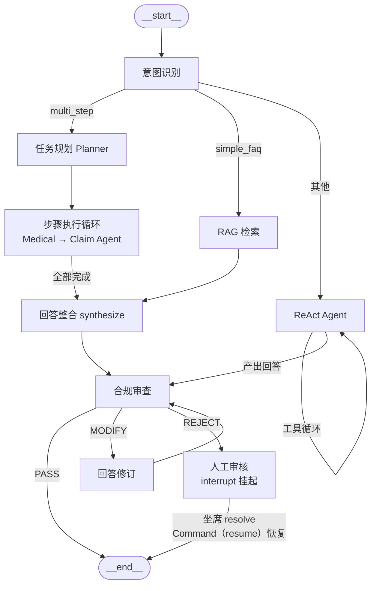
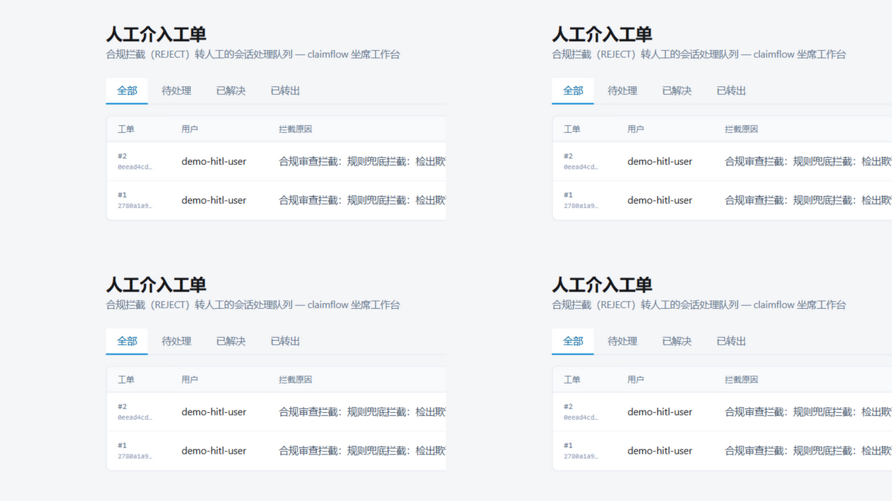
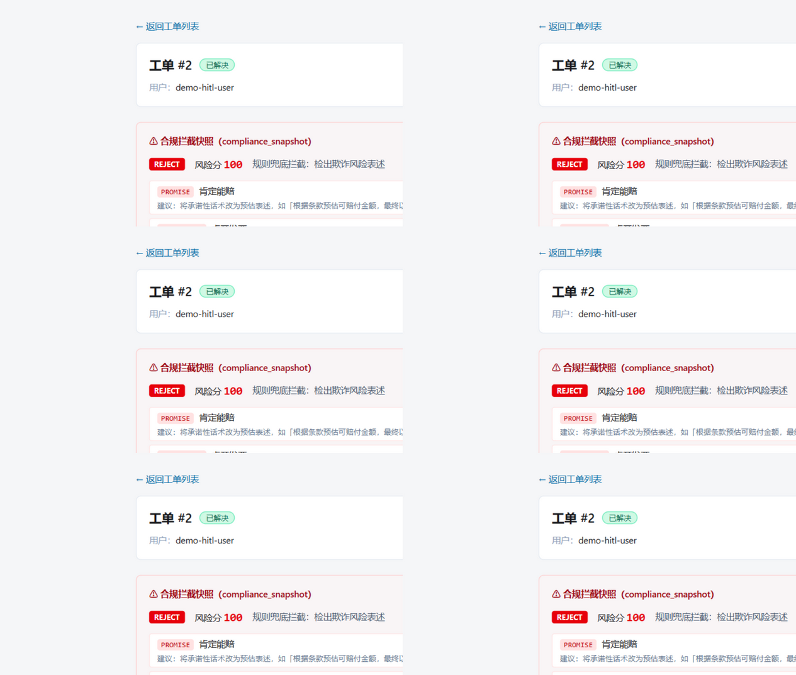

# claimflow — 多智能体保险理赔对话系统

[](https://github.com/Soleil1043/claimflow/actions/workflows/ci.yml)

> Orchestrator-Worker 模式的多智能体理赔咨询系统：调度 Agent 理解意图并制定计划，
> 指挥理赔核算 / 医疗审核 / 合规风控三个专精 Agent 通过工具调用完成跨系统查询，
> 所有输出经合规审查（一票否决）后返回。

## 核心能力

| 能力 | 说明 |
|------|------|
| 意图识别分流 | 五类意图（FAQ / 单领域 / 多步 / 闲聊 / 其他）驱动主图分流，LLM 失败走关键词规则兜底 |
| 多 Agent 协作 | "我做了阑尾炎手术能赔多少" → 自动拆解 2 步计划（医疗审核→理赔核算）依次执行，全程可追溯 |
| RAG 知识库 | 12 篇理赔规则文档（Qdrant + BGE-M3）检索等待期 / 免责 / 材料清单等条款 |
| 合规一票否决 | 所有输出必经 Compliance 节点（图结构保证无旁路）：PASS 直通 / MODIFY 自动修订复审 / REJECT 拦截转人工 |
| 敏感信息脱敏 | 身份证 / 银行卡 / 手机号正则脱敏（`3301**********1234`） |
| OCR 材料识别 | vision 模型提取诊断证明字段（姓名 / 诊断 / 金额 / 日期），API 异常自动降级 Mock 兜底 |
| 状态持久化 | LangGraph Checkpoint（prod=PostgreSQLSaver），多轮上下文连贯、服务重启可恢复 |
| 可观测性 | Prometheus 三类指标（工具 / LLM / 业务）+ Grafana 自动加载仪表盘 + 分环节 Token 预算 |
| 评测体系 | 200 条标注测试集（期望值全量溯源），一键产出任务完成率 / 工具准确率基线报告 |
| 工具结果缓存 | 幂等查询工具 Redis 缓存（dev 内存降级），命中指标可观测 |
| 长期记忆 | 会话摘要 + 关键实体向量化入 Qdrant（user_id 隔离），新会话首轮注入——「我上次问的那张保单」跨会话正确引用 |
| HITL 人工介入 | REJECT 走 LangGraph interrupt 挂起；坐席工作台回写结论 → Command(resume) 恢复会话，结论经合规复审后返回用户 |
| GraphRAG 混合召回 | LLM 从 12 篇条款抽取知识图谱（106 实体/116 关系），实体链接 + 双向 BFS 与向量检索融合——复杂关联问题补充结构化事实（图谱覆盖 87.5%） |
| OTel 全链路追踪 | FastAPI server span + LLM/工具/合规裁决 span，trace_id 贯穿 A06→节点→工具（单轮 25 span 调用树，token 用量入 span 属性） |
| A/B 实验框架 | 变体注册表（模型/供应商/prompt 切换）+ 双比例 z 检验显著性 + token 差分；200 条实测 deepseek vs glm 跨供应商质量等价，配置三行迁移 |

## 架构



- **4 个 Agent**：Orchestrator（调度）/ Claim（理赔核算）/ Medical（医疗审核）/ Compliance（合规风控，一票否决）
- **9 个工具**：保单查询、理赔计算器、RAG 检索、就诊记录、ICD-10 匹配、OCR、规则检查、风险评分、脱敏
- **工具执行器**：统一超时 / 指数退避重试 / 熔断（5 次失败→30s 冷却→半开探测）
- **全链路降级设计**：意图（关键词兜底）/ 规划（规则兜底）/ 合规（确定性兜底）/ OCR（Mock 兜底）/ ReAct（降级话术）——任一 LLM 故障不导致接口报错

## 技术栈

| 类别 | 选型 |
|------|------|
| 语言 | Python 3.12（全量类型注解） |
| Agent 框架 | LangGraph（状态机 + Checkpoint） |
| Web | FastAPI（async）+ Gradio 演示界面 |
| 数据库 | PostgreSQL + SQLAlchemy 2.0 async（dev 降级 SQLite） |
| 向量库 | Qdrant（dev local mode 零容器）+ BGE-M3 本地向量化 |
| LLM | DeepSeek（OpenAI 兼容接口，配置切换；OCR 专职 vision 模型） |
| 工程 | uv / pytest（269 用例）/ ruff / Docker Compose / GitHub Actions |

## 快速开始

### 1. 环境准备

```bash
git clone https://github.com/Soleil1043/claimflow.git
cd claimflow
uv sync
cp .env.example .env   # 填入 LLM_API_KEY（DeepSeek）
```

### 2. 初始化数据（dev profile：SQLite + Qdrant local mode，零容器）

```bash
uv run alembic upgrade head          # 建表
uv run python -m scripts.seed        # Mock 数据入库（保单/就诊记录，幂等）
uv run python -m services.rag.ingest # 知识库向量化入库（首次运行下载 BGE-M3 模型）
```

> 提示：BGE-M3 已缓存后，若 HuggingFace 连接不稳定导致加载缓慢，可设置 `HF_HUB_OFFLINE=1` 跳过在线版本检查。

### 3. 启动

```bash
uv run uvicorn app.main:app --port 8000   # 后端 API
uv run python ui/app.py                   # 演示界面（http://127.0.0.1:7860）
```

### 4. Docker 一键启动（prod profile：PostgreSQL + Qdrant + Redis）

```bash
docker compose up -d
curl http://localhost:8000/health   # {"status":"ok"}
```

### 5. 监控栈（可选：Prometheus + Grafana）

```bash
docker compose --profile monitoring up -d
```

- `http://localhost:3000` → Grafana（匿名 Admin 免登录，自动加载 claimflow 监控总览仪表盘）
- `http://localhost:9090` → Prometheus（抓取 `app:8000/metrics`，15s 周期）
- 10 个面板：工具成功率 / 工具 P95 延迟（按工具）/ 调用量（按状态堆叠）/ 熔断拒绝 /
  LLM 延迟（按模型）/ LLM Token 消耗 / 转人工率 / 合规三态分布 / 对话轮次（按意图）/
  单轮 P95 处理时长；监控栈独立 profile，默认 `up` 不启动
- 不起 Docker 也可直接访问 `http://localhost:8000/metrics`（裸文本指标）

### 6. 坐席工作台（可选：Next.js 15 + React 19 + Tailwind 4）

合规拦截（REJECT）转人工的会话处理前端（`workbench/` 目录）：

```bash
# 终端 1：先启动后端（端口 8000）
uv run uvicorn app.main:app --port 8000

# 终端 2：启动工作台（端口 5173，/api/* 代理直连后端）
cd workbench && npm install && npm run dev
```

- `http://localhost:5173` → 工单列表（状态筛选：待处理 / 已解决 / 已转出）
- 点击工单 → 详情页：合规拦截快照（verdict / 风险分 / 违规明细与建议）、
  会话完整轨迹（可展开工具调用入参出参与 Agent 步骤档案）
- **解决并回写结论** → 触发后端 LangGraph interrupt 恢复（T037）：结论经合规复审后
  返回用户，会话回到 active 可继续对话；坐席结论本身违规时同样被拦截（保守话术）
- 演示数据：后端起 `uv run python -m scripts.demo_hitl_backend` 可自动生成一条
  待处理工单（mock 违规草稿被拦截的完整上下文）





### 7. 追踪栈（可选：OTel Collector + Jaeger）

```bash
docker compose --profile tracing up -d   # Jaeger UI 16686 + OTLP Collector 4317
# .env 设 OTEL_ENABLED=true 后重启后端，发消息即在 Jaeger 看到完整调用树
```

- 采样率 `OTEL_SAMPLING_RATIO` 可配（默认 1.0）；开关关闭时全部埋点 no-op 零开销
- 单轮 multi_step 请求约 25 个 span：A06 server → intent/planner/worker（LLM span 带
  分环节 token 用量）→ 工具 span → 合规裁决 span（verdict / risk_score 属性）

## API

| 接口 | 方法 | 说明 |
|------|------|------|
| `/api/v1/conversations` | POST | 创建会话（返回 conversation_id） |
| `/api/v1/conversations` | GET | 会话列表（分页 + 消息计数） |
| `/api/v1/conversations/{id}` | GET | 会话详情 + 最近消息摘要 |
| `/api/v1/conversations/{id}/messages` | GET | 消息历史（含审计字段） |
| `/api/v1/conversations/{id}/messages` | POST | 发消息（触发完整主图流程） |
| `/api/v1/conversations/{id}/images` | POST | 上传图片材料（vision OCR + Mock 兜底） |
| `/api/v1/interventions` | GET | HITL 工单列表（status 筛选 + 分页） |
| `/api/v1/interventions/{id}` | GET | 工单详情 + 聚合上下文（会话轨迹 / 合规快照 / 拦截原因） |
| `/api/v1/interventions/{id}/resolve` | POST | 坐席解决并回写结论（触发 interrupt 恢复，结论经复审返回） |
| `/api/v1/interventions/{id}/escalate` | POST | 升级转出（线下处理） |
| `/health` | GET | 健康检查（四依赖状态） |

**发消息响应结构**：

```json
{
  "answer": "根据条款预估可赔付 4,640 元，最终以理赔审核结果为准。",
  "intent": "multi_step",
  "used_tools": [{"tool": "policy_query", "input": {}, "output": {}}],
  "agent_steps": [{"step_index": 0, "agent": "medical", "status": "done", "duration_ms": 41593}],
  "compliance_status": "PASS",
  "need_human_intervention": false,
  "intervention_reason": null
}
```

## 测试与验证

```bash
uv run pytest tests -q        # 367 用例全绿（工具单测 + 图级集成 + API 端到端 + 监控/缓存/token/记忆/HITL/AB 框架）
uv run ruff check .           # lint
```

真实 LLM 验收脚本（需 .env 配置 API Key）：`scripts/verify_intent.py`（意图准确率 95%）/
`verify_rag.py` / `verify_planner.py` / `verify_compliance.py` / `verify_ocr.py` / `verify_e2e.py`

## 评测体系

200 条标注测试集（FAQ 30 / 单领域 60 / 多步复杂 80 / 边界异常 30），期望值全量溯源
Mock 数据与知识库文档（如计算类锚点 4,640 元来自理赔规则手册的官方计算示例）。

```bash
# 全量跑（真实 LLM，约 1 小时；需 HF_HUB_OFFLINE=1 跳过 BGE-M3 在线检查）
uv run python -m evals.test_suite

# 子集运行
uv run python -m evals.test_suite --category simple_faq   # 按分类
uv run python -m evals.test_suite --limit 10               # 前 N 条
uv run python -m evals.test_suite --out my_report.json     # 指定输出
```

**基线报告**（`evals/reports/baseline.json`，deepseek-v4-flash 全量 200 条）：

| 指标 | 数值 |
|------|------|
| 任务完成率 | **89.5%**（179/200） |
| 工具调用准确率 | 95.3% |
| 合规通过率 | 99.5%（红线违规 0） |
| 分类水位 | FAQ 93.3% / 单领域 78.3% / 多步 92.5% / 边界 90.0% |

判分规则：`must_include`（必含关键词）/ `any_of`（同义容错）/ `must_not_include`
（合规红线，命中即败）/ 期望工具子集匹配 / 转人工一致性；失败明细可从报告 failures 字段逐条溯源。

**GraphRAG 对比**（24 条复杂关联用例，`--dataset graph_assoc`）：纯 RAG 与混合召回完成率持平
（95.8%），混合召回增益在检索信号维度——图谱覆盖 87.5%、每例 +6.9 条跨文档结构化事实
（小语料下完成率天花板效应，语料扩大后增益预期放大）。

**A/B 实验**（T040 框架 + T041 实战）：

```bash
uv run python -m evals.ab_test --variants baseline,glm-5.3-flash   # 跨供应商 200 条全量
```

变体注册表支持模型 / 供应商（$ 配置间接引用）/ prompt 路径切换；组间对比含双比例 z 检验
显著性粗判与 LLM token 差分。实战结论（D019）：deepseek-v4-flash vs glm-5.3-flash 质量统计
等价（完成率 90.5% vs 89.5%、工具准确率 96.3% vs 95.8%，均不显著），主链路维持 DeepSeek，
glm 注册为容灾备选——跨供应商可迁移性实证（配置三行切换）。

## 项目结构

```
app/          FastAPI 入口与路由        agents/     4 个 Agent 定义
nodes/        LangGraph 节点（8 个）     tools/      工具层（claim/medical/compliance）
workflows/    主图组装                  services/   LLM / RAG / DB / 缓存 / 观测
schemas/      Pydantic 模型             tests/      367 个测试用例
scripts/      seed 与验收脚本           data/       Mock 数据与知识库文档
ui/           Gradio 演示界面           evals/      评测集与运行器（200 条）
grafana/      仪表盘 JSON               prometheus/  抓取配置
```

详细架构设计见 `docs/architecture.md`，构建过程与决策记录见 `.agent/`（progress / decisions）。

## 设计要点

1. **合规门禁是图结构保证而非约定**：所有输出路径的条件边必经 compliance 节点，任何代码路径无法绕过
2. **合规裁决不依赖 LLM 可用性**：规则工具（正则）取证 + LLM 裁决 + 确定性兜底（FRAUD_RISK 或
   risk≥80 → REJECT），LLM 宕机时拦截能力不失效
3. **Worker Agent 结构化输出**：每步产出经 Pydantic schema 校验的 JSON 结论，写入共享数据池
   供后续步骤与整合节点消费
4. **OCR 降级语义**：识别失败返回预置 Mock 数据并显式标记 `source`，下游计算拿到的金额要么可信要么来源明确
5. **长期记忆写路径幂等**：point id = uuid5(conversation_id) 确定性，一会话一条记忆重复写覆盖；
   读注入按 user_id filter 隔离，无历史用户检索空直跳零影响
6. **坐席结论也过合规门禁**：HITL 恢复的坐席结论经同一 review_answer 复审——实测复述违规词的
   结论被拦截（保守话术返回），F10 在人工路径同样成立

## 范围说明（MVP 边界）

保单 / 医疗系统为可信 Mock 数据（OCR 为真实 vision API + Mock 兜底）。原"MVP 边界"中
列为 Phase 4 规划的 GraphRAG / A/B 测试 / OTel 追踪均已交付（见上文各章节）；决策记录与
构建过程见 `.agent/`（decisions D001-D019 / progress 全量日志）。
