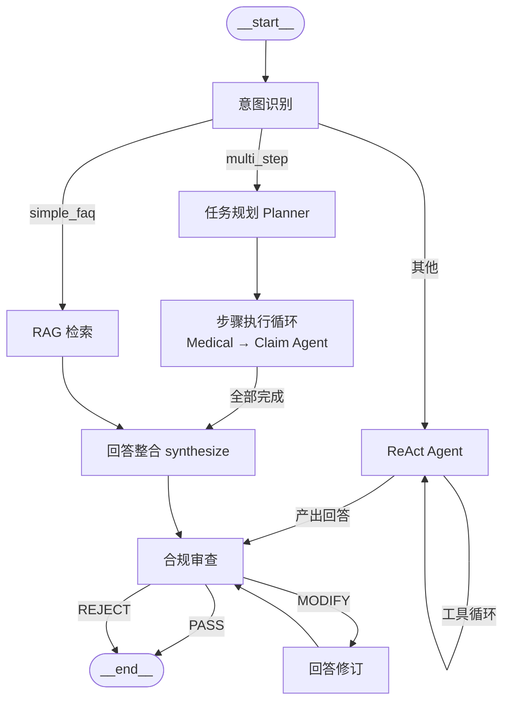

# claimflow — 多智能体保险理赔对话系统

[](https://github.com/Soleil1043/claimflow/actions/workflows/ci.yml)

> Orchestrator-Worker 模式的多智能体理赔咨询系统：调度 Agent 理解意图并制定计划，
> 指挥理赔核算 / 医疗审核 / 合规风控三个专精 Agent 通过工具调用完成跨系统查询，
> 所有输出经合规审查（一票否决）后返回。

## 核心能力

| 能力 | 说明 |
|------|------|
| 意图识别分流 | 五类意图（FAQ / 单领域 / 多步 / 闲聊 / 其他）驱动主图分流，LLM 失败走关键词规则兜底 |
| 多 Agent 协作 | "我做了阑尾炎手术能赔多少" → 自动拆解 2 步计划（医疗审核→理赔核算）依次执行，全程可追溯 |
| RAG 知识库 | 12 篇理赔规则文档（Qdrant + BGE-M3）检索等待期 / 免责 / 材料清单等条款 |
| 合规一票否决 | 所有输出必经 Compliance 节点（图结构保证无旁路）：PASS 直通 / MODIFY 自动修订复审 / REJECT 拦截转人工 |
| 敏感信息脱敏 | 身份证 / 银行卡 / 手机号正则脱敏（`3301**********1234`） |
| OCR 材料识别 | vision 模型提取诊断证明字段（姓名 / 诊断 / 金额 / 日期），API 异常自动降级 Mock 兜底 |
| 状态持久化 | LangGraph Checkpoint（prod=PostgreSQLSaver），多轮上下文连贯、服务重启可恢复 |

## 架构



- **4 个 Agent**：Orchestrator（调度）/ Claim（理赔核算）/ Medical（医疗审核）/ Compliance（合规风控，一票否决）
- **9 个工具**：保单查询、理赔计算器、RAG 检索、就诊记录、ICD-10 匹配、OCR、规则检查、风险评分、脱敏
- **工具执行器**：统一超时 / 指数退避重试 / 熔断（5 次失败→30s 冷却→半开探测）
- **全链路降级设计**：意图（关键词兜底）/ 规划（规则兜底）/ 合规（确定性兜底）/ OCR（Mock 兜底）/ ReAct（降级话术）——任一 LLM 故障不导致接口报错

## 技术栈

| 类别 | 选型 |
|------|------|
| 语言 | Python 3.12（全量类型注解） |
| Agent 框架 | LangGraph（状态机 + Checkpoint） |
| Web | FastAPI（async）+ Gradio 演示界面 |
| 数据库 | PostgreSQL + SQLAlchemy 2.0 async（dev 降级 SQLite） |
| 向量库 | Qdrant（dev local mode 零容器）+ BGE-M3 本地向量化 |
| LLM | DeepSeek（OpenAI 兼容接口，配置切换；OCR 专职 vision 模型） |
| 工程 | uv / pytest（220 用例）/ ruff / Docker Compose / GitHub Actions |

## 快速开始

### 1. 环境准备

```bash
git clone https://github.com/Soleil1043/claimflow.git
cd claimflow
uv sync
cp .env.example .env   # 填入 LLM_API_KEY（DeepSeek）
```

### 2. 初始化数据（dev profile：SQLite + Qdrant local mode，零容器）

```bash
uv run alembic upgrade head          # 建表
uv run python -m scripts.seed        # Mock 数据入库（保单/就诊记录，幂等）
uv run python -m services.rag.ingest # 知识库向量化入库（首次运行下载 BGE-M3 模型）
```

> 提示：BGE-M3 已缓存后，若 HuggingFace 连接不稳定导致加载缓慢，可设置 `HF_HUB_OFFLINE=1` 跳过在线版本检查。

### 3. 启动

```bash
uv run uvicorn app.main:app --port 8000   # 后端 API
uv run python ui/app.py                   # 演示界面（http://127.0.0.1:7860）
```

### 4. Docker 一键启动（prod profile：PostgreSQL + Qdrant + Redis）

```bash
docker compose up -d
curl http://localhost:8000/health   # {"status":"ok"}
```

## API

| 接口 | 方法 | 说明 |
|------|------|------|
| `/api/v1/conversations` | POST | 创建会话（返回 conversation_id） |
| `/api/v1/conversations` | GET | 会话列表（分页 + 消息计数） |
| `/api/v1/conversations/{id}` | GET | 会话详情 + 最近消息摘要 |
| `/api/v1/conversations/{id}/messages` | GET | 消息历史（含审计字段） |
| `/api/v1/conversations/{id}/messages` | POST | 发消息（触发完整主图流程） |
| `/api/v1/conversations/{id}/images` | POST | 上传图片材料（vision OCR + Mock 兜底） |
| `/health` | GET | 健康检查（四依赖状态） |

**发消息响应结构**：

```json
{
  "answer": "根据条款预估可赔付 4,640 元，最终以理赔审核结果为准。",
  "intent": "multi_step",
  "used_tools": [{"tool": "policy_query", "input": {}, "output": {}}],
  "agent_steps": [{"step_index": 0, "agent": "medical", "status": "done", "duration_ms": 41593}],
  "compliance_status": "PASS",
  "need_human_intervention": false,
  "intervention_reason": null
}
```

## 测试与验证

```bash
uv run pytest tests -q        # 220 用例全绿（工具单测 + 图级集成 + API 端到端）
uv run ruff check .           # lint
```

真实 LLM 验收脚本（需 .env 配置 API Key）：`scripts/verify_intent.py`（意图准确率 95%）/
`verify_rag.py` / `verify_planner.py` / `verify_compliance.py` / `verify_ocr.py` / `verify_e2e.py`

## 项目结构

```
app/          FastAPI 入口与路由        agents/     4 个 Agent 定义
nodes/        LangGraph 节点（8 个）     tools/      工具层（claim/medical/compliance）
workflows/    主图组装                  services/   LLM / RAG / DB / 记忆
schemas/      Pydantic 模型             tests/      220 个测试用例
scripts/      seed 与验收脚本           data/       Mock 数据与知识库文档
ui/           Gradio 演示界面           evals/      评测（Phase 3）
```

详细架构设计见 `docs/architecture.md`，构建过程与决策记录见 `.agent/`（progress / decisions）。

## 设计要点

1. **合规门禁是图结构保证而非约定**：所有输出路径的条件边必经 compliance 节点，任何代码路径无法绕过
2. **合规裁决不依赖 LLM 可用性**：规则工具（正则）取证 + LLM 裁决 + 确定性兜底（FRAUD_RISK 或
   risk≥80 → REJECT），LLM 宕机时拦截能力不失效
3. **Worker Agent 结构化输出**：每步产出经 Pydantic schema 校验的 JSON 结论，写入共享数据池
   供后续步骤与整合节点消费
4. **OCR 降级语义**：识别失败返回预置 Mock 数据并显式标记 `source`，下游计算拿到的金额要么可信要么来源明确

## 范围说明（MVP 边界）

保单 / 医疗系统为可信 Mock 数据（OCR 为真实 vision API + Mock 兜底）；监控（Prometheus /
Grafana）、评测体系、GraphRAG 为后续 Phase 规划，见 `.agent/spec.md` 非目标一节。
