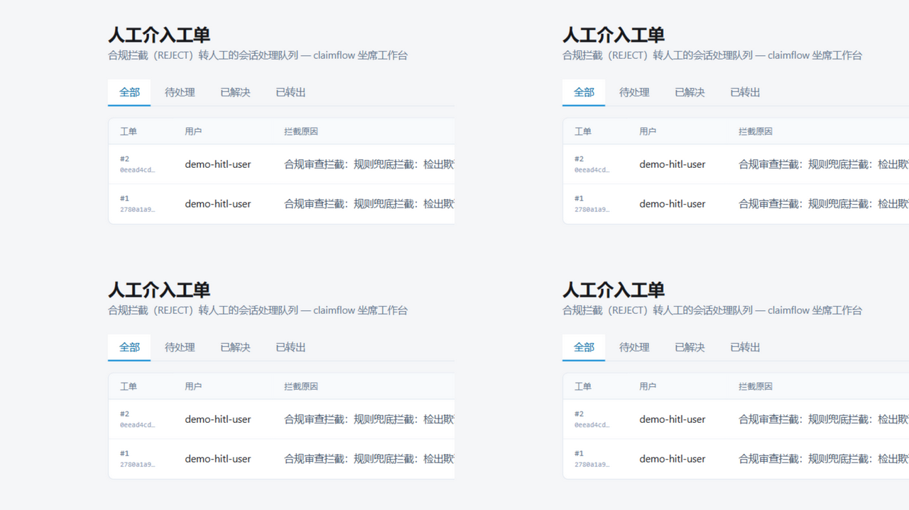
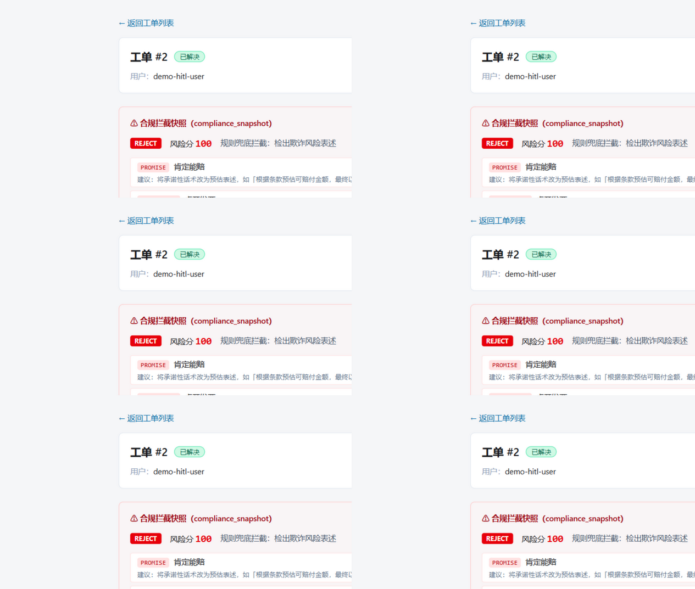
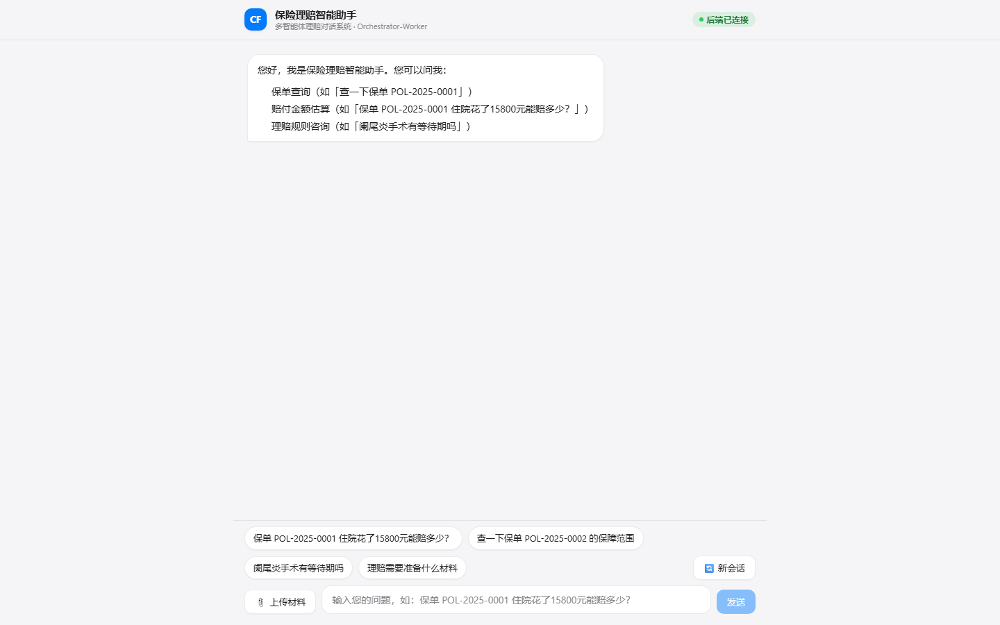
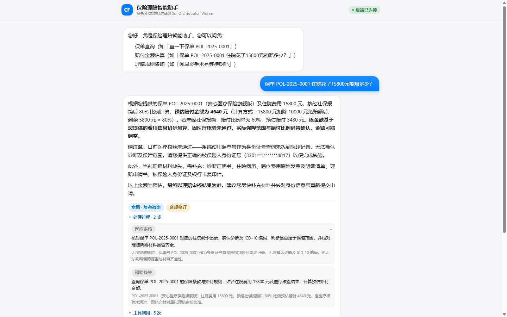

# claimflow — 多智能体保险理赔对话系统

[](https://github.com/Soleil1043/claimflow/actions/workflows/ci.yml)

> Orchestrator-Worker 模式的多智能体理赔咨询系统：调度 Agent 理解意图并制定计划，
> 指挥理赔核算 / 医疗审核 / 合规风控三个专精 Agent 通过工具调用完成跨系统查询，
> 所有输出经合规审查（一票否决）后返回。

## 核心能力

| 能力 | 说明 |
|------|------|
| 意图识别分流 | 五类意图（FAQ / 单领域 / 复杂咨询 / 闲聊 / 其他）结构化输出枚举 + 条件边分流，LLM 失败走关键词规则兜底 |
| 多 Agent 协作 | Supervisor 动态调度（Command(goto) + 计划对账，支持执行中重规划）："我做了阑尾炎手术能赔多少" → 自动编排 medical→claim 两个 create_agent 子图，全程可追溯 |
| RAG 知识库 | 12 篇理赔规则文档（Qdrant + BGE-M3）检索等待期 / 免责 / 材料清单等条款 |
| 重排序精排（可选开关） | bge-reranker-v2-m3 CrossEncoder：top-8 召回 → 精排 → top-4，默认关（小语料下评测结论：次序去重有改善、完成率不显著，D020） |
| 合规一票否决 | 所有输出必经 Compliance 节点（图结构保证无旁路）：PASS 直通 / MODIFY 自动修订复审 / REJECT 拦截转人工 |
| 敏感信息脱敏 | 身份证 / 银行卡 / 手机号正则脱敏（`3301**********1234`） |
| 材料识别（图片/PDF/Word） | 上传诊断证明等材料提取字段（姓名 / 诊断 / 金额 / 日期）：文本型 PDF/Word 走主链路模型、扫描件渲染走 vision VLM、API 异常自动降级 Mock 兜底（T049/D024） |
| 状态持久化 | LangGraph Checkpoint（prod=PostgreSQLSaver），多轮上下文连贯、服务重启可恢复 |
| 可观测性 | Prometheus 三类指标（工具 / LLM / 业务）+ Grafana 自动加载仪表盘 + 分环节 Token 预算 |
| 评测体系 | 218 条主测试集 + 多轮/对抗/关联专项集（期望值全量溯源），五层判分（关键词/数值精确断言/轨迹/LLM-judge/转人工）+ CI 回归门禁 + Wilson CI 报告 |
| 工具结果缓存 | 幂等查询工具 Redis 缓存（dev 内存降级），命中指标可观测 |
| 长期记忆 | 会话摘要 + 关键实体向量化入 Qdrant（user_id 隔离），新会话首轮注入——「我上次问的那张保单」跨会话正确引用 |
| HITL 人工介入 | REJECT 走 LangGraph interrupt 挂起；坐席工作台回写结论 → Command(resume) 恢复会话，结论经合规复审后返回用户 |
| GraphRAG 混合召回 | LLM 从 12 篇条款抽取知识图谱（106 实体/116 关系），实体链接 + 双向 BFS 与向量检索融合——复杂关联问题补充结构化事实（图谱覆盖 87.5%） |
| OTel 全链路追踪 | FastAPI server span + LLM/工具/合规裁决 span，trace_id 贯穿 A06→节点→工具（单轮 25 span 调用树，token 用量入 span 属性） |
| A/B 实验框架 | 变体注册表（模型/供应商/prompt 切换）+ 双比例 z 检验显著性 + token 差分；200 条实测 deepseek vs glm 跨供应商质量等价，配置三行迁移 |

## 架构


```mermaid
graph TD
    START([__start__]) --> intent[意图识别<br/>with_structured_output 枚举]
    intent -->|complex_consult| supervisor[Supervisor 调度<br/>RoutingDecision + Command（goto）]
    intent -->|simple_faq| rag[RAG 检索]
    intent -->|其他| react[通用助手子图<br/>create_agent]
    supervisor -->|goto=medical| medical[medical 子图<br/>create_agent・医疗审核]
    supervisor -->|goto=claim| claim[claim 子图<br/>create_agent・理赔核算]
    supervisor -->|goto=FINISH| synth[回答整合 synthesize]
    medical --> supervisor
    claim --> supervisor
    rag --> synth
    react -->|工具循环内置| compliance[合规审查<br/>结构化三态判决]
    synth --> compliance
    compliance -->|PASS| END([__end__])
    compliance -->|MODIFY| revise[回答修订] --> compliance
    compliance -->|REJECT| human_review[人工介入<br/>interrupt 挂起]
    human_review -->|坐席 resolve<br/>Command（resume）恢复| END
```

- **4 个 Agent**：Supervisor（调度，动态路由 + 执行中重规划）/ Claim（理赔核算）/ Medical（医疗审核）/ Compliance（合规风控，一票否决）——Worker 均为 `langchain.agents.create_agent` 官方子图
- **9 个工具**：保单查询、理赔计算器、RAG 检索、就诊记录、ICD-10 匹配、OCR、规则检查、风险评分、脱敏——继承 langchain 官方 BaseTool
- **工具守卫层**：官方 `.with_retry()` 重试 + 守卫（超时 / 熔断 5 次失败→30s 冷却→半开探测 / 缓存白名单），随工具对象走、循环内外统一生效
- **全链路降级设计**：意图（关键词兜底）/ 调度（计划兜底）/ Worker 与 React（summary 降级 / 降级话术）/ 合规（确定性兜底）/ 材料（Mock 兜底）——任一 LLM 故障不导致接口报错

## 技术栈

| 类别 | 选型 |
|------|------|
| 语言 | Python 3.12（全量类型注解） |
| Agent 框架 | LangGraph 1.2（状态机 + Checkpoint + Store）+ LangChain 1.3（create_agent / 结构化输出） |
| Web | FastAPI（async）+ Next.js 对话界面与坐席工作台 + Gradio 评测台 |
| 数据库 | PostgreSQL + SQLAlchemy 2.0 async（dev 降级 SQLite） |
| 向量库 | Qdrant（RAG 知识库，dev local mode）+ BGE-M3 本地向量化；长期记忆用 LangGraph Store（dev=InMemory / prod=AsyncPostgres） |
| LLM | DeepSeek（OpenAI 兼容接口，配置切换；OCR 专职 vision 模型） |
| 工程 | uv / pytest（391 用例）/ ruff / Docker Compose / GitHub Actions |

## 快速开始

### 1. 环境准备

```bash
git clone https://github.com/Soleil1043/claimflow.git
cd claimflow
uv sync
cp .env.example .env   # 填入 LLM_API_KEY（DeepSeek）
```

### 2. 初始化数据（dev profile：SQLite + Qdrant local mode，零容器）

```bash
uv run alembic upgrade head          # 建表
uv run python -m scripts.seed        # Mock 数据入库（保单/就诊记录，幂等）
uv run python -m services.rag.ingest # 知识库向量化入库（首次运行下载 BGE-M3 模型）
```

> 提示：BGE-M3 已缓存后，若 HuggingFace 连接不稳定导致加载缓慢，可设置 `HF_HUB_OFFLINE=1` 跳过在线版本检查。

### 3. 启动

```bash
uv run uvicorn app.main:app --port 8000   # 后端 API
cd chatui && npm install && npm run dev   # Next.js 对话界面（http://localhost:3000，推荐）
uv run python ui/app.py                   # Gradio 演示界面（http://127.0.0.1:7860，对照/兜底）
uv run python ui/eval_app.py              # 评测台界面（http://127.0.0.1:7861）
```

### 4. Docker 一键启动（prod profile：PostgreSQL + Qdrant + Redis）

```bash
docker compose up -d
curl http://localhost:8000/health   # {"status":"ok"}
```

### 5. 监控栈（可选：Prometheus + Grafana）

```bash
docker compose --profile monitoring up -d
```

- `http://localhost:3000` → Grafana（匿名 Admin 免登录，自动加载 claimflow 监控总览仪表盘）
- `http://localhost:9090` → Prometheus（抓取 `app:8000/metrics`，15s 周期）
- 10 个面板：工具成功率 / 工具 P95 延迟（按工具）/ 调用量（按状态堆叠）/ 熔断拒绝 /
  LLM 延迟（按模型）/ LLM Token 消耗 / 转人工率 / 合规三态分布 / 对话轮次（按意图）/
  单轮 P95 处理时长；监控栈独立 profile，默认 `up` 不启动
- 不起 Docker 也可直接访问 `http://localhost:8000/metrics`（裸文本指标）

### 6. 坐席工作台（可选：Next.js 15 + React 19 + Tailwind 4）

合规拦截（REJECT）转人工的会话处理前端（`workbench/` 目录）：

```bash
# 终端 1：先启动后端（端口 8000）
uv run uvicorn app.main:app --port 8000

# 终端 2：启动工作台（端口 5173，/api/* 代理直连后端）
cd workbench && npm install && npm run dev
```

- `http://localhost:5173` → 工单列表（状态筛选：待处理 / 已解决 / 已转出）
- 点击工单 → 详情页：合规拦截快照（verdict / 风险分 / 违规明细与建议）、
  会话完整轨迹（可展开工具调用入参出参与 Agent 步骤档案）
- **解决并回写结论** → 触发后端 LangGraph interrupt 恢复（T037）：结论经合规复审后
  返回用户，会话回到 active 可继续对话；坐席结论本身违规时同样被拦截（保守话术）
- 演示数据：后端起 `uv run python -m scripts.demo_hitl_backend` 可自动生成一条
  待处理工单（mock 违规草稿被拦截的完整上下文）





### 7. 对话界面（Next.js 15，T063 / D032）

用户对话演示前端（`chatui/` 目录），与坐席工作台同设计系统、同代理模式：

```bash
# 终端 1：先启动后端（端口 8000）
uv run uvicorn app.main:app --port 8000

# 终端 2：启动对话界面（端口 3000，/api/* 代理直连后端）
cd chatui && npm install && npm run dev
```

- `http://localhost:3000` → 对话主界面：示例问题 chips 点击即发、消息气泡
  （markdown 渲染）、打字中动效、材料上传识别（图片 / PDF / Word 字段提取卡）、
  头部后端健康状态 pill、一键新会话
- **富数据结构化展示**（相对 Gradio 版的核心增强）：A06 响应的意图与合规三态 pill、
  处理过程（Agent 步骤 + 耗时 + 结论摘要）、工具调用入参折叠明细、转人工提示卡
- 后端不可达 / 处理失败以警示气泡原位提示；`CHATUI_API_TARGET` 可覆盖后端地址
- 同期保留的 Gradio 演示界面（`ui/app.py`）功能口径一致，作为对照与兜底入口





### 8. 界面设计系统（Phase 6 / D030：Apple Design 移植）

四个界面统一消费一套设计令牌（多栈同源，源头 `ui/theme.py` TOKENS）：

| 界面 | 入口 | 技术栈 | 令牌来源 |
|------|------|--------|---------|
| 用户对话界面（Next.js） | `http://localhost:3000` | Next.js 15 + Tailwind 4 | `chatui/app/globals.css`（`@theme` 同名同值） |
| 坐席工作台 | `http://localhost:5173` | Next.js 15 + Tailwind 4 | `workbench/app/globals.css`（`@theme` 同名同值） |
| 用户聊天界面（Gradio） | `http://127.0.0.1:7860` | Gradio 6 | `ui/theme.py`（`build_theme()` + `APP_CSS`） |
| Agent 评测台 | `http://127.0.0.1:7861` | Gradio 6 | `ui/theme.py`（同上共享） |

设计语言（Apple 系统规范的可移植部分）：

- **色彩**：Apple 系统调色板（蓝 `#007AFF` / 绿 `#34C759` / 橙 `#FF9500` / 红 `#FF3B30`），
  背景 `#F5F5F7`、一级文字 `#1D1D1F`
- **排版**：系统字体栈（PingFang SC / 微软雅黑回退）；大标题负 tracking、正文 0、
  数字 `tabular-nums`；层级 = 字重 + 字号 + 行距组合
- **材质**：浮层 chrome 半透明毛玻璃（`backdrop-filter: blur + saturate`），内容从其下滚过；
  hairline 分隔线；卡片 16px / 气泡 18px 连续圆角近似
- **动效**：按压即时反馈 `:active scale(0.97) / 100ms`；统一 `cubic-bezier(0.32, 0.72, 0, 1)`
  标准缓动；`prefers-reduced-motion` / `prefers-reduced-transparency` 自动降级
- **反馈**：四态语义 pill（ok/warn/err/info）；评测台 KPI 大数字卡 + 渐变进度条；
  聊天/评测台头部实时后端健康状态点（demo.load 探测 `/health`）

**Phase 6.5 视觉深化（D031，impeccable 方法论）**：仅深化两 Gradio 界面（坐席工作台不动）——

- **深度层次**：分层阴影 `--cf-shadow-1/2/3` 替代单层；卡片微渐变表面（`#FFFFFF→#FBFBFD`）；
  页面顶部极淡蓝色 radial wash（拒绝纯灰死板背景）
- **动效生命感**：入场 `cf-rise/cf-fade`（ease-out-quint，交错延迟 60/120ms）；KPI 卡 hover 升起；
  warn 状态点脉冲；poll 高频更新区禁用入场动画防重放；全部走 `prefers-reduced-motion` 降级
- **排版节奏**：区块标题体系（`cf-kicker` 大写小字 + 蓝色短划线 + `cf-h2/cf-h3`）
- **细节打磨**：`::selection` 蓝色选区、自定义细滚动条、隐藏 Gradio footer、placeholder 对比度、
  表格行 hover、输入焦点光环（3px 蓝晕）、primary 按钮 hover 升起、Tab 胶囊化、
  分类明细表 mini 进度条（通过率语义配色 ≥80% 绿 / ≥60% 橙 / 其余红）
- **演示界面**：头部品牌 logo 块 + 状态 pill 化；聊天区去卡片化（气泡直接浮于底色）；
  上传改 `gr.UploadButton` 单控件；composer 行居中
- **评测台**：趋势 / 历史报告 `gr.Tabs` 分区；状态区卡片化；区块标题体系统一
- 派生令牌（`--cf-shadow-*` / `--cf-ease-out` 等）不影响双栈同源契约（`TOKENS` 核心值不动）

界面截图见 `docs/diagrams/`（t055 聊天 / t056 评测台 / t057 工作台列表与详情 /
t060 聊天深化版 / t061 评测台深化版 / t062 宽屏居中 + 真 420 移动端适配版 /
t063 Next.js 对话界面首页 + 对话富数据展示）。

### 9. 追踪栈（可选：OTel Collector + Jaeger）

```bash
docker compose --profile tracing up -d   # Jaeger UI 16686 + OTLP Collector 4317
# .env 设 OTEL_ENABLED=true 后重启后端，发消息即在 Jaeger 看到完整调用树
```

- 采样率 `OTEL_SAMPLING_RATIO` 可配（默认 1.0）；开关关闭时全部埋点 no-op 零开销
- 单轮 complex_consult 请求约 25 个 span：A06 server → intent/supervisor/worker（LLM span 带
  分环节 token 用量）→ 工具 span → 合规裁决 span（verdict / risk_score 属性）

## API

| 接口 | 方法 | 说明 |
|------|------|------|
| `/api/v1/conversations` | POST | 创建会话（返回 conversation_id） |
| `/api/v1/conversations` | GET | 会话列表（分页 + 消息计数） |
| `/api/v1/conversations/{id}` | GET | 会话详情 + 最近消息摘要 |
| `/api/v1/conversations/{id}/messages` | GET | 消息历史（含审计字段） |
| `/api/v1/conversations/{id}/messages` | POST | 发消息（触发完整主图流程） |
| `/api/v1/conversations/{id}/materials` | POST | 上传材料·图片/PDF/Word（兼容别名 `/images`；两段式提取 + Mock 兜底） |
| `/api/v1/interventions` | GET | HITL 工单列表（status 筛选 + 分页） |
| `/api/v1/interventions/{id}` | GET | 工单详情 + 聚合上下文（会话轨迹 / 合规快照 / 拦截原因） |
| `/api/v1/interventions/{id}/resolve` | POST | 坐席解决并回写结论（触发 interrupt 恢复，结论经复审返回） |
| `/api/v1/interventions/{id}/escalate` | POST | 升级转出（线下处理） |
| `/health` | GET | 健康检查（四依赖状态） |

**发消息响应结构**：

```json
{
  "answer": "根据条款预估可赔付 4,640 元，最终以理赔审核结果为准。",
  "intent": "complex_consult",
  "used_tools": [{"tool": "policy_query", "input": {}, "output": {}}],
  "agent_steps": [{"step_index": 0, "agent": "medical", "status": "done", "duration_ms": 41593}],
  "compliance_status": "PASS",
  "need_human_intervention": false,
  "intervention_reason": null
}
```

## 测试与验证

```bash
uv run pytest tests -q        # 367 用例全绿（工具单测 + 图级集成 + API 端到端 + 监控/缓存/token/记忆/HITL/AB 框架）
uv run ruff check .           # lint
```

真实 LLM 验收脚本（需 .env 配置 API Key）：`scripts/verify_intent.py`（意图准确率 95%）/
`verify_rag.py` / `verify_compliance.py` / `verify_ocr.py` / `verify_e2e.py` / `verify_memory_read.py`

## 评测体系

**218 条**主测试集（FAQ 30 / 单领域 60 / 多步复杂 80 / 边界异常 30 / 转人工期望 18）+
三个专项数据集（复杂关联 24 / 多轮对话 30 / 安全对抗 20），期望值全量溯源
Mock 数据与知识库文档（如计算类锚点 4,640 元来自理赔规则手册的官方计算示例）。

```bash
# 全量跑（真实 LLM，约 1 小时；需 HF_HUB_OFFLINE=1 跳过 BGE-M3 在线检查）
uv run python -m evals.test_suite

# 子集运行
uv run python -m evals.test_suite --category simple_faq   # 按分类
uv run python -m evals.test_suite --limit 10               # 前 N 条
uv run python -m evals.test_suite --out my_report.json     # 指定输出

# 专项数据集（Phase 7 强化，D033）
uv run python -m evals.test_suite --dataset multiturn     # 多轮会话记忆（T070）
uv run python -m evals.test_suite --dataset adversarial   # 安全对抗红线（T071）
uv run python -m evals.test_suite --judge --limit 20      # LLM-as-judge 二层判分（T068）

# CI 回归门禁（PR smoke 20 条，完成率降幅 >5pp 退出码 1）
uv run python scripts/check_eval_gate.py ci_report.json
```

判分五层（Phase 7 审计整改后）：关键词（must_include / any_of / must_not_include 红线）→
**数值精确断言**（expected_numbers：数字归一化 + 边界匹配，金额算错必挂，T067）→
工具/轨迹（子集匹配 + 五维轨迹独立报告，T069）→ **LLM-judge**（rubric 三维独立口径，
T068）→ 转人工一致性（human_match 并入 passed）。报告附 Wilson 95% CI / p95 耗时 /
token 每例，无数据维度显 N/A 不误读（T073）。

### 评测台 UI（T051）

后端启动后运行 `uv run python ui/eval_app.py`，浏览器打开 <http://127.0.0.1:7861>：
选数据集/分类/变体/条数上限 → 点击「开始评测」→ 实时查看逐用例 PASS/FAIL 进度与日志；
运行结束自动加载报告（汇总指标 / 分类明细 / 轨迹质量 D026 / 失败用例明细），历史报告
下拉可回看。评测由后端子进程执行（同一时间只允许一个运行），报告与 CLI 共存于
`evals/reports/`。

**基线报告**（`evals/reports/baseline.json`，deepseek-v4-flash 全量 218 条，v1.1.0，2026-09-03）：

| 指标 | 数值 | 说明 |
|------|------|------|
| 任务完成率 | **79.8%**（174/218）CI [74.0%, 84.6%] | 剔除转人工类后老 200 条口径 **87.0%**，与 t048 回归持平（新类目未拉低存量水位） |
| 转人工 recall / precision | **0%**（18 期望 / 0 实际转） | 北极星基线首次量化：系统尚无 HITL 触发路径，目标差距全部暴露 |
| 意图准确率 | **62.5%**（80 条） | 低于 F03 的 90% 线——意图判错由 supervisor 动态路由兜底（完成率 91.2% 未受累），遗留优化项 |
| 工具调用准确率 | 93.9%（196 条考核） | |
| 轨迹质量（D026 独立口径） | order 96.9%（64）/ route 97.1%（34）/ limit 33.3%（6） | 次数上限维度抓到 3 条 ReAct 绕圈用例 |
| LLM-judge（独立口径） | 判过率 98.6%（207 条，未并入完成率） | 校准（人工抽检对齐率 ≥85%）后方可采信 |
| 耗时 / 成本 | avg 10.4s / p95 27.8s / 818.7 tok/例 | |

旧基线（200 条口径）存档为 `baseline_v1_200_20260825.json`。指标口径详见
`docs/architecture.md` §9（Phase 7 强化批次 T064-T074）。

**GraphRAG 对比**（24 条复杂关联用例，`--dataset graph_assoc`）：纯 RAG 与混合召回完成率持平
（95.8%），混合召回增益在检索信号维度——图谱覆盖 87.5%、每例 +6.9 条跨文档结构化事实
（小语料下完成率天花板效应，语料扩大后增益预期放大）。

**A/B 实验**（T040 框架 + T041 实战）：

```bash
uv run python -m evals.ab_test --variants baseline,glm-5.3-flash   # 跨供应商 200 条全量
```

变体注册表支持模型 / 供应商（$ 配置间接引用）/ prompt 路径切换；组间对比含双比例 z 检验
显著性粗判与 LLM token 差分。实战结论（D019）：deepseek-v4-flash vs glm-5.3-flash 质量统计
等价（完成率 90.5% vs 89.5%、工具准确率 96.3% vs 95.8%，均不显著），主链路维持 DeepSeek，
glm 注册为容灾备选——跨供应商可迁移性实证（配置三行切换）。

## 项目结构

```
app/          FastAPI 入口与路由        agents/     4 个 Agent 定义
nodes/        LangGraph 节点（8 个）     tools/      工具层（claim/medical/compliance）
workflows/    主图组装                  services/   LLM / RAG / DB / 缓存 / 观测
schemas/      Pydantic 模型             tests/      367 个测试用例
scripts/      seed 与验收脚本           data/       Mock 数据与知识库文档
ui/           Gradio 演示/评测界面      chatui/     Next.js 对话界面（T063）
workbench/    坐席工作台（Next.js）     evals/      评测集与运行器（218+84 条）
grafana/      仪表盘 JSON               prometheus/  抓取配置
```

详细架构设计见 `docs/architecture.md`，构建过程与决策记录见 `.agent/`（progress / decisions）。

## 设计要点

1. **合规门禁是图结构保证而非约定**：所有输出路径的条件边必经 compliance 节点，任何代码路径无法绕过
2. **合规裁决不依赖 LLM 可用性**：规则工具（正则）取证 + LLM 裁决 + 确定性兜底（FRAUD_RISK 或
   risk≥80 → REJECT），LLM 宕机时拦截能力不失效
3. **Worker Agent 结构化输出**：每步产出经 Pydantic schema 校验的 JSON 结论，写入共享数据池
   供后续步骤与整合节点消费
4. **OCR 降级语义**：识别失败返回预置 Mock 数据并显式标记 `source`，下游计算拿到的金额要么可信要么来源明确
5. **长期记忆写路径幂等**：point id = uuid5(conversation_id) 确定性，一会话一条记忆重复写覆盖；
   读注入按 user_id filter 隔离，无历史用户检索空直跳零影响
6. **坐席结论也过合规门禁**：HITL 恢复的坐席结论经同一 review_answer 复审——实测复述违规词的
   结论被拦截（保守话术返回），F10 在人工路径同样成立

## 范围说明（MVP 边界）

保单 / 医疗系统为可信 Mock 数据（OCR 为真实 vision API + Mock 兜底）。原"MVP 边界"中
列为 Phase 4 规划的 GraphRAG / A/B 测试 / OTel 追踪均已交付（见上文各章节）；决策记录与
构建过程见 `.agent/`（decisions D001-D019 / progress 全量日志）。
