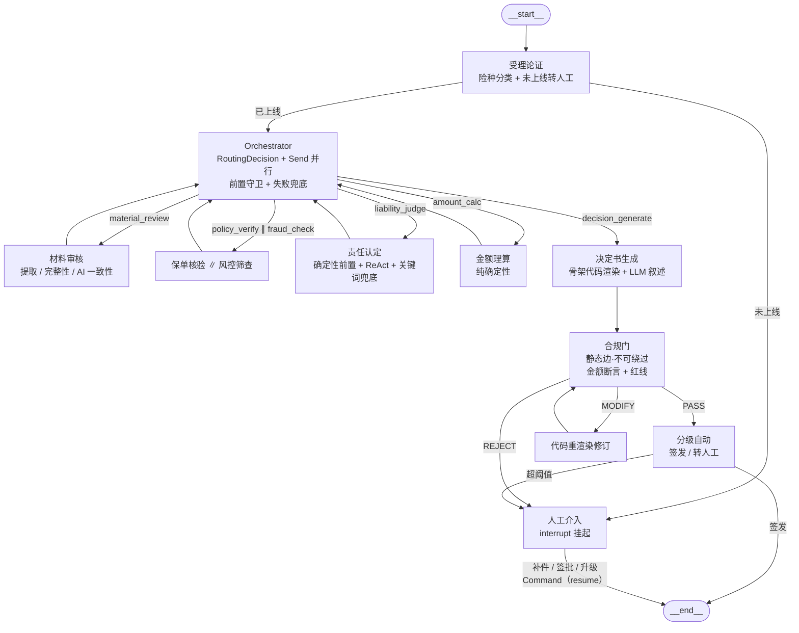

# claimflow — 保险理赔智能核赔平台（多险种）

[](https://github.com/Soleil1043/claimflow/actions/workflows/ci.yml)
[](https://www.python.org/)
[](LICENSE)
[](https://docs.astral.sh/ruff/)

客户提交理赔申请与材料后，**LLM Orchestrator 动态调度专业 Worker**（材料审核 / 保单核验 /
风控筛查 / 责任认定 / 金额理算 / 决定书生成）完成自动核赔：低风险小额案件自动签发
《理赔决定书》，其余转人工复核。领域知识以 skill 作业规程包（`skills/<stage>/<line>.md`）
承载——准确率迭代改文本不改代码。

> **TL;DR** — A multi-line insurance auto-adjudication platform: an LLM Orchestrator
> dispatches six specialized workers over a case pipeline, with precondition guards in code,
> a graph-enforced compliance gate that routing can never bypass, and deterministic fallback
> on any LLM failure. HITL tickets (supplement / review / escape) via interrupt + resume,
> plus an in-portal AI support agent with human escalation. All external systems are
> faithfully mocked; runs end-to-end on a real LLM.

## 目录

1. [一次核赔长什么样](#1-一次核赔长什么样)
2. [成果指标](#2-成果指标)
3. [核心能力一览](#3-核心能力一览)
4. [架构](#4-架构)
5. [快速开始](#5-快速开始)
6. [可选组件](#6-可选组件)
7. [评测体系](#7-评测体系)
8. [API](#8-api)
9. [设计决策](#9-设计决策)
10. [已知限制与路线图](#10-已知限制与路线图)
11. [安全与数据声明](#11-安全与数据声明)
12. [License 与作者](#12-license-与作者)

---

## 1. 一次核赔长什么样

> **客户**：提交案件——急性阑尾炎住院手术，花费 15,800 元，保单 POL-2025-0001，
> 上传发票 / 诊断证明 / 费用清单。
>
> **系统**：`intake`（保单产品类型分类 → 医疗险，已上线）→ `orchestrator`（LLM 调度，
> 守卫强制先做材料审核）→ `material_review`（三段提取 + 完整性 + AI 一致性）→
> `policy_verify ∥ fraud_check`（并行：保额 100 万 / 免赔 1 万、无黑名单记录）→
> `liability_judge`（确定性前置通过 → ReAct 条款检索，covered）→ `amount_calc`
> （确定性：(15800−10000)×0.8 = 4,640 元）→ `decision_generate` → `compliance_gate`
> （金额三方断言 + 红线检查，PASS）→ **自动签发《理赔决定书》，案件关闭**。
>
> 全程审计事件落库（路由决策含守卫修正可回放）；若有材料缺失，案件挂起为补件工单，
> 客户补传后自动恢复。

---

## 2. 成果指标

> 金样本评测门（`evals/adjudication_suite.py` 六门体系）+ 独立对抗回归门。
> 负向指标同样前置——它们证明评测门真的在工作。

| 门 | 数值 | 说明 |
|------|------|------|
| 金额正确率（硬门） | **100%** | 153 案期望金额按规格公式精确到分逐一断言 |
| 红线漏放（硬门） | **0** | 与运行时合规门同一实现（check_text）复验 |
| 守卫旁路（硬门） | **0** | 必做集未全 done 而出决定书的案件数 |
| 路由一致率（软门） | **100%**（门禁 ≥95%） | 与金样本期望派发序列一致 |
| 责任认定一致率（软门） | **100%**（门禁 ≥90%） | 确定性前置 + ReAct + 关键词兜底三层口径 |
| 调度预算 | 5 ≤ 15/案件 | orchestrator 防绕圈预算（D039） |
| 对抗集（硬门） | **14/14** | 注入/诱导 8 条 + 同义词鲁棒性 6 条，确定性与 LLM 双模式全绿（T142） |

- LLM 模式全量：153/153 = **100%** 六门全绿（deepseek-flash 真实调度，T130）
- 调度成本实测：**7,075.8 tokens/案**，延迟 6.22s/案（p95 7.68s）vs 确定性 0.25s
- 单元与集成测试：**444 passed**（图结构断言 / 守卫注入 100% 拦截 / interrupt 跨重启恢复 / checkpoint 版本降级重跑）

---

## 3. 核心能力一览

| 能力 | 一句话价值 |
|------|-----------|
| LLM Orchestrator-Worker | RoutingDecision 结构化输出 + Send 并行派发，前置条件由代码守卫强制 |
| 静态合规门 | decision_generate → compliance_gate 是图上焊死的边，任何路由决策无法绕过 |
| 分级自动签发 | 低风险 + 责任明确 + 金额阈值内自动出《理赔决定书》；否则转人工（阈值全配置化） |
| HITL 三类工单 | 补件 / 核赔复核 / 升级——interrupt 挂起，客户补传自动恢复，坐席结论必过合规复审 |
| 险种 pack | `schemas/lines.py` 一份 pack = 一个险种的全部知识；医疗/车险/财产险/意外险四线已上线（T120），产品类型不在任何 pack（unknown）受理转人工 |
| StageSpec 单源 | 六阶段的名字 / 前置 / 快照 / 回边 / prompt 清单由一份注册表派生（加阶段只改一处） |
| 金额安全设计 | 全链路 Decimal，正文金额三方断言不依赖 LLM，叙述段零金额注入 |
| 在线客服（T132-T137） | 门户悬浮 AI 助手（RAG 问答 / 案件进度查询 / 报案链接预填）+ 转人工坐席闭环（escalated 状态机 + workbench 客服工单） |
| 申请人记忆治理（T138） | 终态确定性渲染写入，置信度门控（< 0.6 不写）+ 应用层 TTL + 坐席删除链路 |
| 决定书叙述抽评（T139） | 5% 确定性采样人工质检（种子 = case_id 可复算），workbench 抽评队列 + 通过率统计 |
| 对抗回归门（T124/T142） | 注入 / 诱导 / PII / 同义词鲁棒性 14 案独立数据集，与主门同进 CI 门禁 |
| 全链路可观测 | Prometheus/Grafana 8 面板（结案率 / 阶段 P95 / 调度健康 / 守卫纠错）+ OTel/Jaeger |

---

## 4. 架构


```mermaid
graph TD
    START([__start__]) --> intake[受理论证<br/>险种分类 + 未上线转人工]
    intake -->|已上线| orch[Orchestrator<br/>RoutingDecision + Send 并行<br/>前置守卫 + 失败兜底]
    intake -->|未上线| human_gate
    orch -->|material_review| mr[材料审核<br/>提取 / 完整性 / AI 一致性]
    orch -->|policy_verify ∥ fraud_check| pv[保单核验 ∥ 风控筛查]
    orch -->|liability_judge| lj[责任认定<br/>确定性前置 + ReAct + 关键词兜底]
    orch -->|amount_calc| ac[金额理算<br/>纯确定性]
    orch -->|decision_generate| dg[决定书生成<br/>骨架代码渲染 + LLM 叙述]
    mr --> orch
    pv --> orch
    lj --> orch
    ac --> orch
    dg --> cg[合规门<br/>静态边·不可绕过<br/>金额断言 + 红线]
    cg -->|PASS| aa[分级自动<br/>签发 / 转人工]
    cg -->|MODIFY| revise[代码重渲染修订] --> cg
    cg -->|REJECT| human_gate[人工介入<br/>interrupt 挂起]
    aa -->|签发| END([__end__])
    aa -->|超阈值| human_gate
    human_gate -->|补件 / 签批 / 升级<br/>Command（resume）| END
```

四个要点：

1. **阶段知识单源（StageSpec）**：六阶段的结论 channel / 产出模型 / 前置条件 /
   路由快照字段 / prompt 清单由 `schemas/stages.py` 注册表派生——守卫查表、图回边、
   评测断言与 LLM 看到的目标清单全部同源
2. **安全对冲四件套（D039）**：静态合规门不可绕过 / 前置守卫违规改投 / LLM 失败走
   险种确定性默认计划 / 路由决策全量审计落 case_events
3. **险种 pack（InsuranceLinePack）**：受理分类、必需材料、条款要素、责任认定兜底
   规则一份声明式数据；上新车险 = 新增 pack + skill 文本，节点零改动
4. **状态持久化**：LangGraph Checkpoint（prod=AsyncPostgresSaver，thread_id=case_id）
   支撑 interrupt 挂起与跨服务重启恢复；案件事实态以 cases 表为准

---

## 5. 快速开始

### 5.1 本地开发（dev profile：SQLite + Qdrant local mode，零容器依赖）

```bash
# 1. 安装
git clone https://github.com/Soleil1043/claimflow.git && cd claimflow
uv sync && cp .env.example .env    # .env 填入 LLM_API_KEY（DeepSeek）

# 2. 初始化数据（建表 + Mock 种子 + 知识库向量化，均幂等）
uv run alembic upgrade head
uv run python -m scripts.seed
uv run python -m services.rag.ingest    # 首次运行下载 BGE-M3 模型（~2GB）

# 3. 启动
uv run uvicorn app.main:app --port 8000       # 后端 API
cd chatui && npm install && npm run dev       # 案件提交门户 http://localhost:3000
```

### 5.2 Docker 一键（prod profile：PostgreSQL + Qdrant + Redis）

```bash
docker compose up -d && curl http://localhost:8000/health   # → {"status":"ok"}
```

### 5.3 验证与测试

```bash
uv run pytest -q                                   # 444 用例
uv run ruff check .
uv run python -m evals.adjudication_suite          # 金样本评测门（确定性，零 LLM）
uv run python -m scripts.verify_adjudication --offline   # 离线兜底档（零 API Key）
uv run python -m scripts.verify_multiinstance --boot --offline   # 双实例 live 冒烟（自起 8010/8011，跨实例补件恢复）
uv run python -m scripts.verify_adjudication             # 完整档（需真 Key：自动签发+金额+决定书）
uv run python scripts/smoke_support_e2e.py         # 客服全链路冒烟（需真 Key + dev 栈）
```

冒烟脚本走真实链路：现场生成 Word 材料 → 提取 → 自动签发/补件闭环/未上线险种
escape/工单列表。两种档位：

| 档位 | 前置 | 覆盖 |
|------|------|------|
| `--offline`（默认兜底） | 零 API Key | 受理、上传落档、补件闭环、状态机、审计、escape、工单（材料提取降级 Mock → 置信度不足按设计转人工） |
| 完整档 | 真 Key | 上述 + 自动签发 4640.00 + 决定书（签发与金额正确性另有零 LLM 的评测门 coverage） |

CI 默认跑离线档（不需要任何 secret）；仓库配了 `LLM_API_KEY` secret 时自动升级
为完整档。材料只声明不上传会按设计转人工（T140 置信度校准），故必须上传真实
文件才会走到自动签发。

---

## 6. 可选组件

| 组件 | 启动 | 入口 |
|------|------|------|
| 监控栈（Prometheus + Grafana） | `docker compose --profile monitoring up -d` | Grafana `:3000`，自动加载核赔 8 面板：自动结案率 / 转人工率 / 调度调用 / 守卫纠错 / 阶段耗时 P95 / 端到端耗时 / 案件量 / 核定金额 |
| 追踪栈（OTel + Jaeger） | `docker compose --profile tracing up -d`<br>`.env` 设 `OTEL_ENABLED=true` | Jaeger UI `:16686` |
| 坐席工作台（HITL + 客服） | `cd workbench && npm install && npm run dev` | `:5173` 核赔工单列表 + 详情（审计时间线 / 决定书版本卡 / 签批改判表单）+ 客服工单（transcript / 回复 / 关闭）+ 叙述抽评审队列 |
| 案件提交门户 | `cd chatui && npm install && npm run dev` | `:3000` 提交 + 进度时间线 + 决定书查看 + 补件上传 + 悬浮 AI 客服（问答 / 查进度 / 转人工） |

- 后端裸指标：`http://localhost:8000/metrics`（无需监控栈）

---

## 7. 评测体系

**金样本评测集 153 案件**（`evals/datasets/adjudication.json`，生成器确定性枚举 +
24 手工底座）：正常签发 / 拒赔 / 部分责任 / 风控 / 边界 / 缺件 / 受理分类七类覆盖，
医疗/车险/财产险/意外险四线，期望金额按规格公式精确到分。

**对抗回归集 14 案**（`evals/datasets/adjudication_adversarial.json`）：注入 / 角色伪装 /
虚构免责 / 红线诱导 / PII 诱导 / 施压翻转 / 事实伪造 / 字段注入 8 条 + 除外同义词
鲁棒性 6 条——独立数据集不污染主基线，与主门同进 CI。

```bash
uv run python -m evals.adjudication_suite                       # 主门 153 案（确定性，零 LLM）
uv run python -m evals.adjudication_suite --llm                 # LLM Orchestrator 全链（真实 LLM）
uv run python -m evals.adjudication_suite --dataset adversarial # 对抗门 14 案
uv run python -m evals.adjudication_suite --limit 20            # 子集冒烟（CI 即此口径）
uv run python -m evals.support_suite                            # 客服问答门 15 案（真实 LLM，T146）
```

**六门体系**：硬门（金额正确率 100% / 红线漏放 0 / 守卫旁路 0 / 对抗集全过）+
软门（路由一致率 ≥95% / 责任一致率 ≥90%）+ 预算（调度调用 ≤15）。门禁阈值与运行时
配置同源（`schemas/contract.py`）——评测门 = 运行时门，不会漂移。

**客服问答门**（`evals/datasets/support_qa.json`，15 案五类：知识 / 进度 / 红线 /
库外 / 转人工）：关键词组 + 禁止词 + 转人工终态三层确定性判分，硬门 100%；检索
命中率为分层观测。客服 Agent 无确定性路径，本门需真 Key，定位本地手动门
（CI 跑其数据集校验与判分单测）。

---

## 8. API

### 核赔案件

| 接口 | 方法 | 说明 |
|------|------|------|
| `/api/v1/cases` | POST | 提交案件（自然键幂等；后台队列驱动核赔管线，受理即返回） |
| `/api/v1/cases/{id}` | GET | 案件详情：进度 / 结论 / 决定书版本 / 审计时间线（seq 回放） |
| `/api/v1/cases/{id}/materials` | POST | 上传材料（图片/PDF/Word 两段式提取；补件挂起时自动恢复流程） |
| `/api/v1/cases/material-catalog` | GET | 险种材料目录（pack 单源派生，新险种上线前端零改动） |

> 🔒 **坐席端点鉴权**（T147，D067 路径 A）：标注 🔒 的端点需请求头 `X-Staff-Key`。
> 多 Key 配置（`STAFF_KEYS="alice:key1,bob:key2"`）+ **Key 即身份**——坐席名由 Key
> 派生，审计 operator 不再依赖请求体自报；dev 未配置时放行（向后兼容），prod 启动
> 强制非空。客户端点（案件 / 客服会话）无鉴权要求。

### HITL 工单

| 接口 | 方法 | 说明 |
|------|------|------|
| `/api/v1/interventions/cases` | GET | 核赔工单列表（补件 / 复核 / 升级挂起案件）🔒 |
| `/api/v1/interventions/cases/{id}/resolve` | POST | 工单处理：签批 / 改判 / 补传 / 升级（坐席文本必过红线复审）🔒 |
| `/api/v1/interventions/narrative-samples` | GET | 叙述抽评审队列（pending 样本 + 决定书全文 + 通过率统计）🔒 |
| `/api/v1/interventions/cases/{id}/narrative-review` | POST | 叙述抽评：pass / revise + 评语（落审计事件）🔒 |

### 在线客服（门户 ↔ 坐席）

| 接口 | 方法 | 说明 |
|------|------|------|
| `/api/v1/support/conversations` | POST | 建立客服会话（201） |
| `/api/v1/support/conversations/{id}` | GET | 会话状态（ai / escalated / closed，门户轮询入口） |
| `/api/v1/support/conversations/{id}/messages` | GET | 三方消息时间线（user / assistant / agent） |
| `/api/v1/support/conversations/{id}/messages` | POST | 发消息：ai 态 AI 应答；escalated 态坐席接管停答 |
| `/api/v1/support/tickets` | GET | 坐席客服工单队列（escalated 会话倒序 + 最新消息预览）🔒 |
| `/api/v1/support/tickets/{id}` | GET | transcript 三方消息全文（closed 会话可查作审计）🔒 |
| `/api/v1/support/tickets/{id}/reply` | POST | 坐席回复（role=agent 入时间线）🔒 |
| `/api/v1/support/tickets/{id}/close` | POST | 关闭会话（备注先入时间线再流转终态）🔒 |

### 记忆治理

| 接口 | 方法 | 说明 |
|------|------|------|
| `/api/v1/memory/{user_id}/entries/{case_id}` | DELETE | 删除单条申请人记忆（adelete + human 审计事件）🔒 |

### 基础设施

| 接口 | 方法 | 说明 |
|------|------|------|
| `/health` | GET | 健康检查（postgres/qdrant/redis/llm 依赖状态） |
| `/metrics` | GET | Prometheus 指标 |

**提交响应结构**：

```json
{
  "case_id": "CASE-2026-0001",
  "case_type": "medical",
  "status": "auto_issued",
  "final_decision": "approved",
  "approved_amount": "4640.00",
  "decision_document": {"version": 1, "title": "理赔决定书", "conclusion": "approved"},
  "human": null,
  "idempotent": false
}
```

---

## 9. 设计决策

全文最值得读的六条（完整决策链见 [`.agent/decisions.md`](.agent/decisions.md)）：

1. **静态合规门是图结构保证而非约定**——decision_generate → compliance_gate 为静态边
   （有图结构测试断言），LLM 路由决策永远无法绕过
2. **LLM 调度的对冲四件套**——前置守卫违规改投 / 必做集强制收敛 / 失败走确定性默认
   计划 / 决策审计可回放，orchestrator 失控不等于核赔失控
3. **金额不依赖 LLM**——理算纯确定性工具 + 决定书正文三方金额断言 + 叙述段零金额注入
   （骨架代码渲染），LLM 幻觉进不了金额字段
4. **skill 是调优面**——各阶段 SOP 装载进 system prompt，准确率迭代改 `skills/` 文本
   不改代码；漂移由金样本路由一致率软门兜住
5. **阶段/险种知识单源**——StageSpec 注册表与 InsuranceLinePack 让"加一个阶段 /
   上一个险种"从改 8-10 个文件变成加一份声明式数据
6. **坐席结论也过合规门**——HITL 恢复的人工结论经同一审查函数复审，违规不签发

---

## 10. 已知限制与路线图

| 限制 | 现状 | 下一步 |
|------|------|--------|
| dev 记忆/缓存仍进程内 | 交付队列与 checkpoint 已多实例安全（T155 租约 + sqlite 共享后端）；dev 的长期记忆 InMemoryStore 与工具内存缓存不跨实例共享 | 多实例 dev 对记忆为旁路降级；prod 用 PostgresStore/Redis 共享 |
| 客服无流式输出 | 门户轮询 3s 获取回复（无 SSE/WebSocket） | 需要 MVP 后迭代 |
| 小语料 RAG 天花板 | 12 篇条款文档，检索增益有天花板 | 语料扩充后重开精排对比 |
| 客服日期推断 | 用户只说"9月20日"时模型自行补年份（应为当前年） | prompt 补"日期以当前年份推算" |

> 历史限制已清零：金额硬门 97.73%→100%（T122 等待期边界 + 日期 + frequency 信号三修）、
> 单险种→四险种上线（T120）、对抗集 57.1%→100%（T142 同义词清账）、CI 冒烟依赖 secret→
> 离线兜底档（T145）。演进记录见 [`.agent/progress.md`](.agent/progress.md)。

---

## 11. 安全与数据声明

- **全部业务数据为虚构 Mock**：保单 / 病历 / 证件号均为种子脚本生成的仿真数据，
  不含任何真实 PII；Mock 数据结构参考真实理赔场景
- **输出脱敏设计**：身份证 / 银行卡 / 手机号在渲染层正则脱敏（`3301**********1234`），
  决定书正文签发前再过一道红线检查（check_text）
- **密钥管理**：全部密钥经环境变量注入，仓库不含真实凭据

---

## 12. License 与作者

[MIT](LICENSE) © 2026 Soleil1043（[GitHub](https://github.com/Soleil1043)）

> 本项目为个人作品集项目：LLM Orchestrator-Worker 编排 / 合规工程 / 评测体系的完整
> 工程实践，构建日志与全部 40 条技术决策记录公开于 [`.agent/`](.agent/)。
