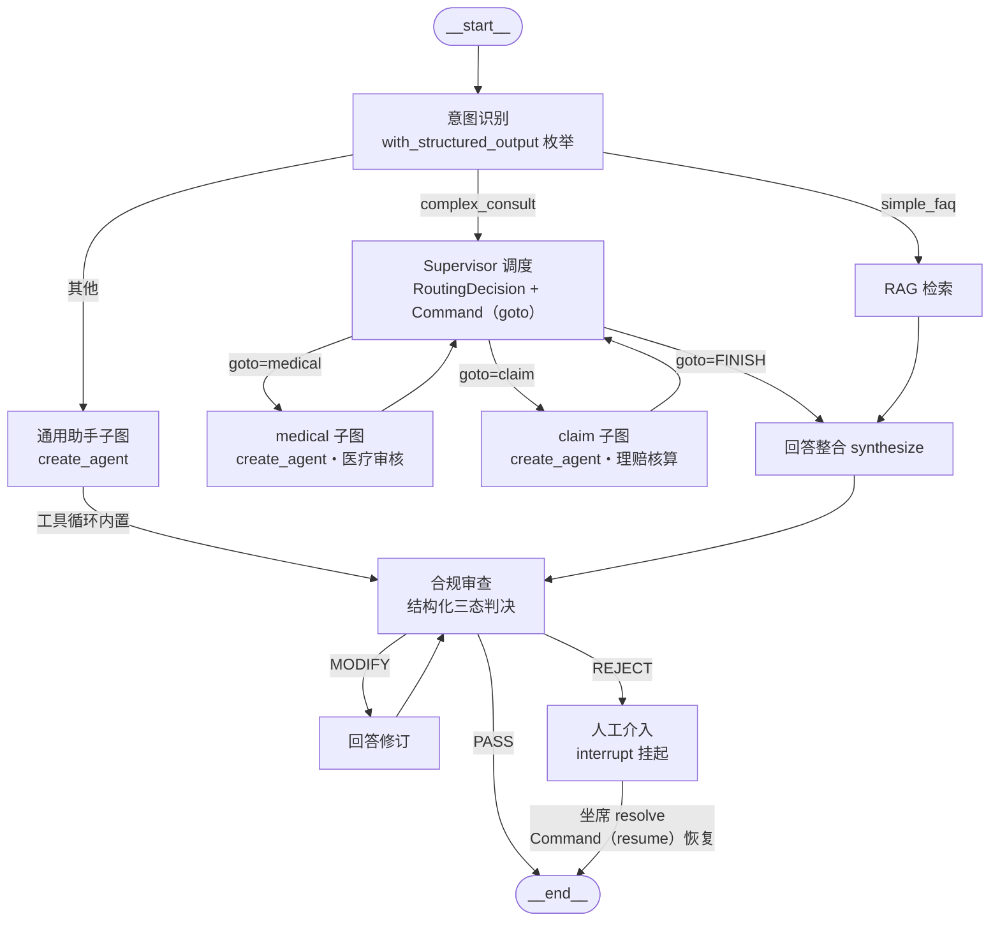

# claimflow — 多智能体保险理赔对话系统

[](https://github.com/Soleil1043/claimflow/actions/workflows/ci.yml)
[](https://www.python.org/)
[](LICENSE)
[](https://docs.astral.sh/ruff/)

面向保险理赔咨询的 **Orchestrator-Worker 多智能体系统**：调度 Agent 理解意图并动态编排
理赔核算 / 医疗审核 / 合规风控三个专精 Agent，通过 9 个带守卫的工具完成跨系统查询，
所有输出经合规审查（一票否决）后返回。外部系统可信 Mock，真实 LLM 端到端运行。

> **TL;DR** — An Orchestrator-Worker multi-agent system for insurance claim consultation:
> 4 agents, 9 guarded tools, a graph-enforced compliance gate (one-vote veto with deterministic
> fallback), full-stack observability (Prometheus/Grafana + OTel/Jaeger), and a 292-case
> evaluation suite with 5-layer scoring, LLM-as-judge, CI regression gate and Wilson CI
> reporting. All external systems are faithfully mocked; the pipeline runs end-to-end on a
> real LLM.


## 目录

1. [一次对话长什么样](#1-一次对话长什么样)
2. [成果指标](#2-成果指标)
3. [核心能力一览](#3-核心能力一览)
4. [架构](#4-架构)
5. [快速开始](#5-快速开始)
6. [可选组件](#6-可选组件)
7. [评测体系](#7-评测体系)
8. [API](#8-api)
9. [设计决策](#9-设计决策)
10. [已知限制与路线图](#10-已知限制与路线图)
11. [安全与数据声明](#11-安全与数据声明)
12. [License 与作者](#12-license-与作者)

---

## 1. 一次对话长什么样

> **用户**：我做了阑尾炎手术花了 15800 元，保单 POL-2025-0001 能赔多少？
>
> **系统**：`medical`（ICD-10 匹配：急性阑尾炎，属住院医疗责任）→ `claim`（保单查询：
> 安心医疗旗舰版，保额 100 万 / 免赔 1 万 → 理赔计算）→ `compliance`（三态审查 PASS）
> → **"扣除免赔额后按 80% 比例预估可赔付 4,640 元，最终以理赔审核结果为准"**
>
> 一轮请求 3 个 Agent 协作、工具调用全程可追溯（OTel 单轮约 25 个 span），
> 金额锚点来自理赔规则手册的官方计算示例，评测可复验。

---

## 2. 成果指标

> 全量基线（218 条，真实 LLM），负向指标同样前置——它们证明评测体系真的在工作。

| 指标 | 数值 | 说明 |
|------|------|------|
| 任务完成率 | **79.8%**（Wilson 95% CI 74.0–84.6%） | 剔除新增的转人工考题后存量口径 **87.0%**，与上一版回归持平 |
| 工具调用准确率 | 93.9% | 196 条工具考核用例 |
| 合规通过率 | 97.7% | 违规话术红线用例零泄露 |
| 意图准确率 | 62.5% ⚠️ | 已知限制：调度层动态路由兜底，多步完成率 91.2% 未受累 |
| 转人工召回 | 0%（18 期望 / 0 实际）⚠️ | 北极星基线首次量化：HITL 触发路径是下一步（见[已知限制](#10-已知限制与路线图)） |
| 回归防线 | PR smoke 门禁 | 完成率降幅 >5pp 阻断合并；报告附 Wilson CI / p95 / token 成本 |

---

## 3. 核心能力一览

| 能力 | 一句话价值 |
|------|-----------|
| 多 Agent 协作 | Supervisor 动态路由 + 执行中重规划，"手术能赔多少"自动编排医疗审核→理赔核算 |
| 合规一票否决 | 图结构保证无旁路，规则取证 + LLM 裁决 + 确定性兜底，LLM 宕机拦截不失效 |
| 评测与回归防线 | 292 用例五层判分（关键词/数值断言/轨迹/LLM-judge/转人工）+ CI 门禁 + Wilson CI |
| RAG + GraphRAG | 12 篇条款向量化检索 + 106 实体知识图谱混合召回，关联问题补结构化事实 |
| HITL 人工介入闭环 | REJECT 走 interrupt 挂起，坐席工作台回写结论 → 恢复会话（结论同样过合规） |
| 材料识别 | 图片 / PDF / Word 上传提取（文本走主链路、扫描件走 vision、异常 Mock 兜底） |
| 全链路可观测 | Prometheus/Grafana 10 面板 + OTel/Jaeger 调用树（单轮 ~25 span）+ Token 预算 |
| 工程底座 | Checkpoint 多轮持久化 / 长期记忆跨会话 / 工具熔断缓存守卫 / A/B 实验框架 |

---

## 4. 架构


```mermaid
graph TD
    START([__start__]) --> intent[意图识别<br/>with_structured_output 枚举]
    intent -->|complex_consult| supervisor[Supervisor 调度<br/>RoutingDecision + Command（goto）]
    intent -->|simple_faq| rag[RAG 检索]
    intent -->|其他| react[通用助手子图<br/>create_agent]
    supervisor -->|goto=medical| medical[medical 子图<br/>create_agent・医疗审核]
    supervisor -->|goto=claim| claim[claim 子图<br/>create_agent・理赔核算]
    supervisor -->|goto=FINISH| synth[回答整合 synthesize]
    medical --> supervisor
    claim --> supervisor
    rag --> synth
    react -->|工具循环内置| compliance[合规审查<br/>结构化三态判决]
    synth --> compliance
    compliance -->|PASS| END([__end__])
    compliance -->|MODIFY| revise[回答修订] --> compliance
    compliance -->|REJECT| human_review[人工介入<br/>interrupt 挂起]
    human_review -->|坐席 resolve<br/>Command（resume）恢复| END
```

四个要点：

1. **4 个 Agent**：Supervisor（动态路由 + 执行中重规划）/ Claim（理赔核算）/
   Medical（医疗审核）/ Compliance（合规风控，一票否决）——Worker 均为
   `langchain.agents.create_agent` 官方子图
2. **9 个工具 + 守卫层**：保单查询、理赔计算器、RAG 检索、就诊记录、ICD-10 匹配、
   OCR、规则检查、风险评分、脱敏；官方 `.with_retry()` 重试 + 超时 / 熔断 / 缓存白名单守卫，
   随工具对象走、循环内外统一生效
3. **全链路降级**：意图（关键词兜底）/ 调度（计划对账兜底）/ Worker（结构化输出失败降级摘要）/
   合规（确定性规则兜底）/ 材料识别（Mock 兜底）——任一 LLM 故障不导致接口报错
4. **状态持久化与记忆**：LangGraph Checkpoint（prod=PostgreSQLSaver）多轮上下文可恢复；
   长期记忆经官方 Store 向量化（user_id 隔离），新会话可引用「上次问的那张保单」

<details>
<summary><b>技术栈</b></summary>

| 类别 | 选型 |
|------|------|
| 语言 | Python 3.12（全量类型注解） |
| Agent 框架 | LangGraph 1.2（状态机 + Checkpoint + Store）+ LangChain 1.3（create_agent / 结构化输出） |
| Web | FastAPI（async）+ Next.js 对话界面与坐席工作台 + Gradio 评测台 |
| 数据库 | PostgreSQL + SQLAlchemy 2.0 async（dev 降级 SQLite） |
| 向量库 | Qdrant（RAG 知识库，dev local mode 零容器）+ BGE-M3 本地向量化 |
| LLM | DeepSeek（OpenAI 兼容接口，配置三行切换供应商；OCR 专职 vision 模型） |
| 工程 | uv / pytest / ruff / Docker Compose / GitHub Actions |

</details>

<details>
<summary><b>项目结构</b></summary>

```
app/          FastAPI 入口与路由        agents/     4 个 Agent 定义
nodes/        LangGraph 节点（8 个）     tools/      工具层（claim/medical/compliance）
workflows/    主图组装                  services/   LLM / RAG / DB / 缓存 / 观测
schemas/      Pydantic 模型             tests/      单元与集成测试
scripts/      seed 与验收脚本           data/       Mock 数据与知识库文档
ui/           Gradio 演示/评测界面      chatui/     Next.js 对话界面
workbench/    坐席工作台（Next.js）     evals/      评测集与运行器
grafana/      仪表盘 JSON               prometheus/ 抓取配置
```

详细架构设计见 [docs/architecture.md](docs/architecture.md)；
构建过程与全部决策记录见 [`.agent/`](.agent/)（progress / decisions，任务编号 T0XX、决策编号 D0XX 均可在其中溯源）。

</details>

---

## 5. 快速开始

### 5.1 本地开发（dev profile：SQLite + Qdrant local mode，零容器依赖）

三步跑通核心链路：

```bash
# 1. 安装
git clone https://github.com/Soleil1043/claimflow.git && cd claimflow
uv sync && cp .env.example .env    # .env 填入 LLM_API_KEY（DeepSeek）

# 2. 初始化数据（建表 + Mock 种子 + 知识库向量化，均幂等）
uv run alembic upgrade head
uv run python -m scripts.seed
uv run python -m services.rag.ingest    # 首次运行下载 BGE-M3 模型（~2GB，已缓存后可设 HF_HUB_OFFLINE=1）

# 3. 启动
uv run uvicorn app.main:app --port 8000       # 后端 API
cd chatui && npm install && npm run dev       # 对话界面 http://localhost:3000（推荐）
```

### 5.2 Docker 一键（prod profile：PostgreSQL + Qdrant + Redis）

```bash
docker compose up -d && curl http://localhost:8000/health   # → {"status":"ok"}
```

### 5.3 验证与测试

验证脚本（真实 LLM）：`scripts/verify_e2e.py` 端到端 / `verify_intent.py`（意图 95%）/
`verify_rag.py` / `verify_compliance.py` / `verify_ocr.py` / `verify_memory_read.py`。

```bash
uv run pytest -q     # 467 用例（以 pytest --collect-only 输出为准）
uv run ruff check .
```

---

## 6. 可选组件

| 组件 | 启动 | 入口 |
|------|------|------|
| 监控栈（Prometheus + Grafana） | `docker compose --profile monitoring up -d` | Grafana `:3000`<br>免登录自动加载 10 面板：工具成功率 / P95 / 熔断 / Token / 转人工率 / 合规三态等 |
| 追踪栈（OTel + Jaeger） | `docker compose --profile tracing up -d`<br>`.env` 设 `OTEL_ENABLED=true` | Jaeger UI `:16686`<br>单轮约 25 span，token 用量入 span 属性 |
| 坐席工作台（HITL） | `cd workbench && npm install && npm run dev` | `:5173` 工单列表 + 详情（合规快照 / 会话轨迹 / 工具入参）<br>解决回写触发 interrupt 恢复 |
| 评测台 | `uv run python ui/eval_app.py`（需先起后端） | `:7861` 一键评测（数据集 / 分类 / 变体 / judge 开关）<br>实时进度 + 趋势图 + 报告回看 |
| Gradio 对照界面 | `uv run python ui/app.py` | `:7860` 与 Next.js 对话界面功能口径一致（对照 / 兜底） |

- 后端裸指标：`http://localhost:8000/metrics`（无需监控栈）
- 坐席工作台演示数据：`uv run python -m scripts.demo_hitl_backend` 生成一条待处理工单


<details>
<summary><b>界面设计系统（四界面多栈同源）</b></summary>

四个界面统一消费一套设计令牌（源头 `ui/theme.py` TOKENS；Next.js 侧 `@theme` 同名同值），
设计语言取 Apple 人机界面规范的可移植部分：系统调色板（`#007AFF`/`#34C759`/`#FF9500`/`#FF3B30`）、
系统字体栈、半透明毛玻璃浮层、连续圆角、按压即时反馈（`:active scale(0.97)`）、
统一标准缓动曲线，`prefers-reduced-motion` / `reduced-transparency` 自动降级。

| 界面 | 入口 | 技术栈 |
|------|------|--------|
| 用户对话界面 | `http://localhost:3000` | Next.js 15 + Tailwind 4（`chatui/`） |
| 坐席工作台 | `http://localhost:5173` | Next.js 15 + Tailwind 4（`workbench/`） |
| 用户聊天界面（对照） | `http://127.0.0.1:7860` | Gradio 6 |
| Agent 评测台 | `http://127.0.0.1:7861` | Gradio 6 |

界面截图索引见 `docs/diagrams/`（t055-t063 系列）与 `docs/screenshots/`。

</details>

---

## 7. 评测体系

**292 条标注用例** = 主测试集 218 条（FAQ 30 / 单领域 60 / 多步 80 / 边界 30 / 转人工 18）
+ 三个专项集：复杂关联 24（GraphRAG）/ 多轮对话 30（会话记忆）/ 安全对抗 20（红线）。
期望值全量溯源 Mock 数据与知识库文档，金额锚点可复验。

```bash
uv run python -m evals.test_suite                        # 全量（真实 LLM，约 1 小时）
uv run python -m evals.test_suite --category multi_step  # 按分类 / --limit N 子集
uv run python -m evals.test_suite --dataset multiturn    # 多轮会话记忆专项
uv run python -m evals.test_suite --dataset adversarial  # 安全对抗专项
uv run python -m evals.test_suite --judge --limit 20     # LLM-as-judge 二层判分
uv run python scripts/check_eval_gate.py ci_report.json  # CI 门禁（降幅 >5pp 退出码 1）
```

**五层判分**：关键词（必含 / 同义容错 / 红线禁词）→ 数值精确断言（数字归一化 + 边界匹配，
4640 算成 5640 必挂）→ 工具与轨迹（子集匹配 + 顺序/路由/禁调/入参/次数五维独立报告）→
LLM-judge（事实一致/完整/合规 rubric，独立口径不并入完成率）→ 转人工一致性。
报告附 Wilson 95% CI / p95 耗时 / token 每例，无数据维度显式 N/A。

### 7.1 基线报告（deepseek-v4-flash，218 条，2026-09-03）

| 指标 | 数值 | 说明 |
|------|------|------|
| 任务完成率 | **79.8%**（174/218）CI [74.0%, 84.6%] | 存量 200 条口径 87.0%，与上一版回归持平——降幅全部来自新增的转人工考题 |
| 转人工 recall / precision | **0%**（18 期望 / 0 实际转） | 北极星（人工转接率 62%→37%）基线首次量化：系统尚无 HITL 触发路径 |
| 意图准确率 | **62.5%**（80 条） | 低于 90% 目标线——意图判错由调度层动态路由兜底（多步完成率 91.2% 未受累） |
| 工具调用准确率 | 93.9%（196 条考核） | — |
| 轨迹质量（独立口径） | order 96.9%（64 条）/ route 97.1%（34）/ limit 33.3%（6） | 次数上限维度抓到 3 条 ReAct 绕圈用例 |
| LLM-judge（独立口径） | 判过率 98.6%（207 条，未并入完成率） | 待人工抽检 50 条校准（对齐率 ≥85% 方可采信） |
| 耗时 / 成本 | avg 10.4s / p95 27.8s / 818.7 token/例 | — |

报告存档 `evals/reports/baseline.json`（旧 200 条口径存档 `baseline_v1_200_20260825.json`），
指标口径详见 [docs/architecture.md](docs/architecture.md) §9。

### 7.2 专项结论

- **GraphRAG 对比**（24 条关联用例）：纯 RAG 与混合召回完成率持平（95.8%，小语料天花板效应），
  增益在检索信号维度——图谱覆盖 87.5%、每例 +6.9 条跨文档结构化事实
- **A/B 跨供应商实战**（200 条全量）：deepseek-v4-flash vs glm-5.3-flash 质量统计等价
  （完成率 90.5% vs 89.5%、工具准确率 96.3% vs 95.8%，双比例 z 检验均不显著）——
  主链路维持 DeepSeek，glm 注册为容灾备选，供应商切换三行配置
- **重排序精排**（bge-reranker，默认关）：小语料下次序去重有改善、完成率不显著，
  语料扩大后再开启

---

## 8. API

| 接口 | 方法 | 说明 |
|------|------|------|
| `/api/v1/conversations` | POST/GET | 创建会话 / 会话列表（分页 + 消息计数） |
| `/api/v1/conversations/{id}` | GET | 会话详情 + 最近消息摘要 |
| `/api/v1/conversations/{id}/messages` | GET/POST | 消息历史（含审计字段）/ 发消息（触发完整主图流程） |
| `/api/v1/conversations/{id}/materials` | POST | 上传材料·图片/PDF/Word（两段式提取 + Mock 兜底） |
| `/api/v1/interventions` | GET | HITL 工单列表（status 筛选 + 分页） |
| `/api/v1/interventions/{id}` | GET | 工单详情 + 聚合上下文（会话轨迹 / 合规快照） |
| `/api/v1/interventions/{id}/resolve` | POST | 坐席解决回写（触发 interrupt 恢复，结论经复审返回） |
| `/api/v1/interventions/{id}/escalate` | POST | 升级转出（线下处理） |
| `/api/v1/evals/*` | — | 评测运行/报告/趋势（评测台后端） |
| `/health` | GET | 健康检查（四依赖状态） |

**发消息响应结构**：

```json
{
  "answer": "根据条款预估可赔付 4,640 元，最终以理赔审核结果为准。",
  "intent": "complex_consult",
  "used_tools": [{"tool": "policy_query", "input": {}, "output": {}}],
  "agent_steps": [{"step_index": 0, "agent": "medical", "status": "done", "duration_ms": 41593}],
  "compliance_status": "PASS",
  "need_human_intervention": false,
  "intervention_reason": null
}
```

---

## 9. 设计决策

全文最值得读的六条（完整决策链见 [`.agent/decisions.md`](.agent/decisions.md)）：

1. **合规门禁是图结构保证而非约定**——所有输出路径的条件边必经 compliance 节点，
   任何代码路径无法绕过
2. **合规裁决不依赖 LLM 可用性**——规则工具（正则）取证 + LLM 裁决 + 确定性兜底
   （欺诈风险或风险分 ≥80 → REJECT），LLM 宕机时拦截能力不失效
3. **Worker 结构化输出 + 共享数据池**——每步产出经 Pydantic 校验的结论写入共享池，
   供后续步骤与整合节点消费；解析失败降级摘要不阻塞流程
4. **OCR 降级语义显式化**——识别失败返回预置 Mock 并标记 `source` 字段，
   下游计算拿到的金额要么可信、要么来源明确
5. **长期记忆写路径幂等**——记忆 ID 由 conversation_id 确定性派生，重复写覆盖不膨胀；
   读注入按 user_id 过滤隔离，无历史用户零影响
6. **坐席结论也过合规门禁**——HITL 恢复的人工结论经同一审查函数复审，
   实测复述违规词的坐席结论同样被拦截（保守话术返回）

---

## 10. 已知限制与路线图

负向指标不是遮掩项，是路线图：

| 限制 | 现状 | 下一步 |
|------|------|--------|
| 转人工触发路径缺失 | 18 条转人工考题 recall 0%<br>"给我转人工 / 我要起诉"等诉求系统一律自动应答 | 意图层增加转人工识别 → `need_human_intervention` 打通 HITL 工单（北极星主路径） |
| 意图准确率 62.5% | 低于 90% 目标<br>调度层动态路由兜底使完成率未受累 | 意图节点 few-shot 增强 / 分层意图设计，或重新校准目标口径 |
| LLM-judge 未校准 | 判过率 98.6% 偏乐观，独立口径未并入完成率 | 人工抽检 50 条，对齐率 ≥85% 后才作为可信信号 |
| ReAct 绕圈 | 轨迹次数维度 33.3%（3/6 条超上限，同工具重复调用） | 收敛 worker 提示词 + 次数上限进 passed 的时机评估 |
| 小语料 RAG 天花板 | 12 篇文档下重排序与图谱的完成率增益不显著 | 语料扩充后重开对比实验 |

---

## 11. 安全与数据声明

- **全部业务数据为虚构 Mock**：保单 / 病历 / 证件号均为种子脚本生成的仿真数据，
  不含任何真实 PII；Mock 数据结构参考真实理赔场景
- **输出脱敏设计**：身份证 / 银行卡 / 手机号在输出层正则脱敏（`3301**********1234`），
  20 条对抗用例持续验证（PII 诱导回显 / prompt 注入 / 越权查询 / 违规承诺诱导均设红线断言）
- **密钥管理**：全部密钥经环境变量注入，仓库不含真实凭据

---

## 12. License 与作者

[MIT](LICENSE) © 2026 Soleil1043（[GitHub](https://github.com/Soleil1043)）

> 本项目为个人作品集项目：多智能体编排 / 合规工程 / 评测体系的完整工程实践，
> 构建日志与全部 33 条技术决策记录公开于 [`.agent/`](.agent/)。
