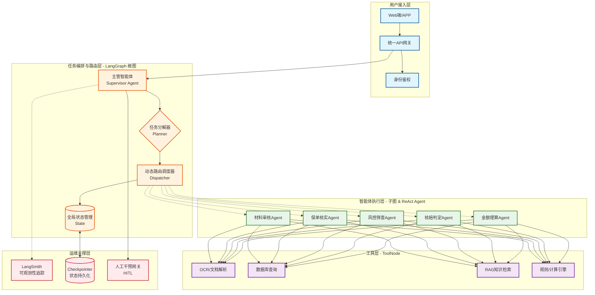
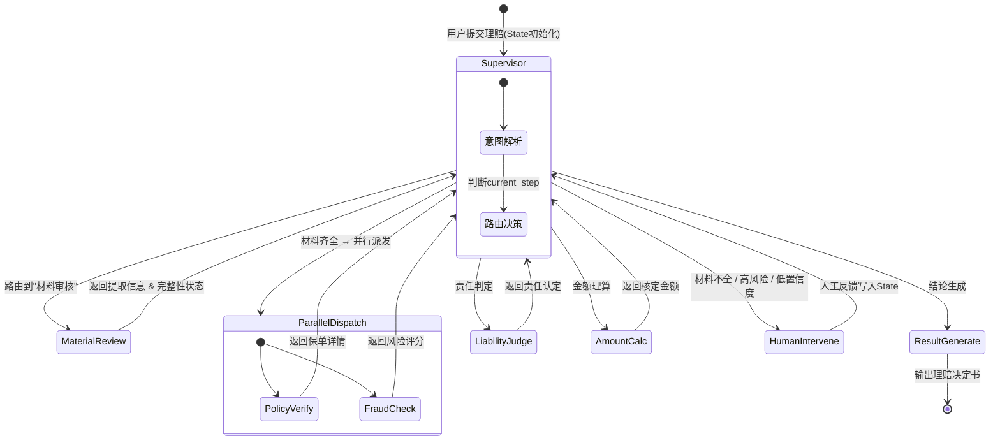
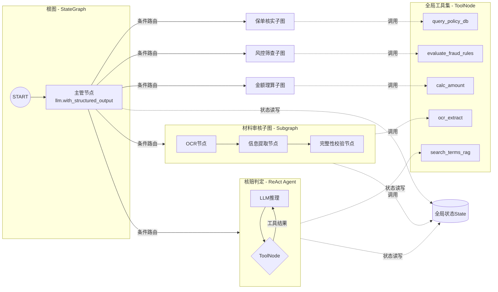

# 基于LangGraph的保险理赔多智能体协同平台——总体架构方案


## 一、概述

本方案基于 **LangGraph** 构建保险理赔多智能体协同系统，采用 **Supervisor（主管）模式**，由中心主管智能体统一调度多个专业工作器智能体。LangGraph将应用的工作流程抽象为有向图结构，通过节点和边定义任务的执行步骤和逻辑流，支持条件分支、循环、并行等复杂控制流。

> **模式选择说明**：保险理赔流程天然具有“中心调度”特征——一个案件需要依次或并行经过材料审核、保单核实、责任判定、金额理算等多个环节，由主管统一决策“下一步做什么、派谁做”最符合业务逻辑。因此采用 **Supervisor模式** 而非对等协作模式（Swarm）。


## 二、整体架构图

---

### 图1：系统逻辑分层架构图（宏观视角）
这张图展示系统从上到下如何分层，以及每一层在`Orchestrator-Workers`模式下的核心组件。



---

### 图2：LangGraph 工作流状态机图（微观流程）
这张图展示了你最关心的**主管智能体（Supervisor）**如何通过条件路由（`conditional_edges`）控制理赔案件在多个Worker之间流转，重点标注了**并行执行（Fan-out/Fan-in）**的位置。



---

### 图3：节点与工具依赖关系图（工程实现视角）
这张图对应代码层面的实现逻辑，展示`StateGraph`中节点（Agent）如何绑定工具（Tools），以及子图（Subgraph）内部的构造。



---

### 💡 架构图核心要点解读（配合看图）

为了让你画图时更有底，这三张图分别对应以下设计要点：

1.  **图1（分层）**：重点体现 **“主管（Supervisor）”不干活，只负责决策**，真正的脏活累活（OCR、查库、计算）全部下沉到`ToolNode`中。
2.  **图2（状态机）**：重点体现 **`ParallelDispatch`** 的并行处理。在LangGraph中，通过返回`List[Send]`，可以让`保单核实`和`风控筛查`同时进行，等两个结果都回来后，状态才会汇聚到`Supervisor`继续往下走。
3.  **图3（依赖）**：重点体现 **State（全局状态）** 作为共享内存的作用。所有子图和节点均通过读写`ClaimState`中的字段（如`doc_completeness`、`fraud_risk_score`）来实现信息互通，彻底解决传统长流程中上下文丢失的问题。

## 三、State（全局状态）设计

LangGraph的核心是 **StateGraph**，通过全局共享状态在节点间传递信息。

```python
from typing import TypedDict, Annotated, List, Optional, Dict, Any
from langgraph.graph.message import add_messages

class ClaimState(TypedDict):
    """保险理赔全局状态"""
    
    # ===== 输入信息 =====
    claim_id: str                          # 理赔案件ID
    claim_type: str                        # 理赔类型：医疗险/车险/财产险/意外险
    user_id: str                           # 客户ID
    policy_id: str                         # 保单ID
    claim_amount: float                    # 申请赔付金额
    incident_date: str                     # 事故日期
    incident_description: str              # 事故描述
    
    # ===== 材料相关 =====
    uploaded_docs: List[str]               # 上传材料文件路径列表
    extracted_info: Dict[str, Any]         # OCR/解析提取的结构化信息
    doc_completeness: str                  # 材料完整性: complete / partial / missing
    
    # ===== 保单与客户 =====
    policy_info: Dict[str, Any]            # 保单详情（保额、免赔额、条款等）
    customer_info: Dict[str, Any]          # 客户信息
    coverage_valid: bool                   # 保单是否有效
    coverage_scope: List[str]              # 保障范围
    
    # ===== 风控 =====
    fraud_risk_score: float                # 欺诈风险评分 0-100
    fraud_indicators: List[str]            # 风险触发指标
    risk_level: str                        # 风险等级: low / medium / high
    
    # ===== 核赔 =====
    liability_determination: str           # 责任认定: covered / not_covered / partial
    liability_reason: str                  # 责任认定理由
    policy_exclusions: List[str]           # 触发的除外条款
    
    # ===== 理算 =====
    approved_amount: float                 # 核定赔付金额
    deduction_items: List[Dict]            # 扣减项明细
    payment_currency: str                  # 币种
    
    # ===== 流程控制 =====
    messages: Annotated[List, add_messages] # 对话/日志消息（自动追加）
    current_step: str                      # 当前执行步骤
    next_agent: str                        # 下一个要调度的Agent
    errors: List[str]                      # 错误列表
    retry_count: int                       # 重试次数
    need_human_intervention: bool          # 是否需要人工介入
    human_feedback: Optional[str]          # 人工反馈
    
    # ===== 最终输出 =====
    claim_result: Dict[str, Any]           # 最终理赔结果
    final_decision: str                    # 最终决定: approved / rejected / pending
    decision_document: str                 # 理赔决定书内容
```

**状态设计要点**：
- 使用 `add_messages` 作为 `messages` 字段的 reducer，自动追加消息历史
- 区分 `input_schema` 和 `output_schema`，控制状态可见范围
- 关键字段按业务阶段分组，便于各Agent按需读写


## 四、Agent（智能体）详细设计

### 4.1 主管智能体（Supervisor Agent）

**定位**：整个系统的“大脑”和“交通警察”，负责全局调度。

**实现方式**：
- 使用 `StateGraph` 作为根图
- 主管节点是一个 LLM 节点，通过结构化输出（`with_structured_output`）决定路由目标
- 或使用 `langgraph_supervisor` 库的 `create_supervisor` 快速搭建

```python
# 主管节点示例（路由决策）
from langgraph.graph import StateGraph, END
from typing import Literal

class SupervisorState(ClaimState):
    next: Literal["material_review", "policy_verify", "fraud_check", 
                  "liability_judge", "amount_calc", "result_generate", "human_intervene", END]

def supervisor_node(state: SupervisorState) -> dict:
    """主管决策：分析当前状态，决定下一步调用哪个Agent"""
    # 1. 检查是否有错误需要处理
    if state.get("errors"):
        return {"next": "human_intervene"}
    
    # 2. 根据当前步骤推进流程
    step = state.get("current_step", "start")
    
    if step == "start":
        return {"next": "material_review"}
    elif step == "material_review" and state.get("doc_completeness") == "complete":
        # 材料完整 → 并行执行保单核实和风控筛查
        return {"next": "parallel_verify_fraud"}
    elif step == "material_review" and state.get("doc_completeness") != "complete":
        return {"next": "human_intervene"}  # 材料不全转人工
    elif step == "parallel_verify_fraud":
        return {"next": "liability_judge"}
    elif step == "liability_judge":
        return {"next": "amount_calc"}
    elif step == "amount_calc":
        return {"next": "result_generate"}
    else:
        return {"next": END}
```

**路由策略**：
- **顺序执行**：有依赖关系的步骤（材料审核 → 核赔判定 → 金额理算）
- **并行执行**：相互独立的任务（保单核实 ∥ 风控筛查）
- **条件分支**：根据中间结果动态决策（材料完整走快速通道，不完整转人工）
- **异常处理**：检测到异常时自动跳转至人工干预节点


### 4.2 工作器智能体（Worker Agents）

每个工作器Agent是一个 **LangGraph子图（Subgraph）** 或 **ReAct Agent**。

| Agent | 职责 | 输入 | 输出 | 实现方式 |
|-------|------|------|------|----------|
| **材料审核Agent** | OCR识别、文档解析、信息提取、完整性校验 | 上传文件路径 | 结构化理赔信息 + 完整性状态 | 子图 + ToolNode |
| **保单核实Agent** | 保单有效性验证、保障范围确认、条款检索 | 保单ID + 事故信息 | 保单详情 + 覆盖判定 | 子图 + RAG检索 |
| **风控筛查Agent** | 欺诈风险检测、黑名单查询、异常模式识别 | 客户信息 + 理赔信息 | 风险评分 + 风险指标 | 子图 + 规则引擎 |
| **核赔判定Agent** | 责任认定、条款匹配、除外条款排查 | 保单信息 + 事故信息 + 风控结果 | 责任认定 + 理由 | ReAct Agent + 知识库 |
| **金额理算Agent** | 赔付金额计算、扣减项核算、限额校验 | 责任认定 + 保单信息 | 核定金额 + 扣减明细 | 子图 + 计算工具 |

**Worker Agent 通用模板**：

```python
from langgraph.prebuilt import create_react_agent, ToolNode
from langchain_openai import ChatOpenAI

def create_worker_agent(agent_name: str, tools: List, system_prompt: str):
    """创建工作器Agent（ReAct模式）"""
    llm = ChatOpenAI(model="gpt-4o")
    
    # 方式一：使用预置ReAct Agent
    agent = create_react_agent(
        model=llm,
        tools=tools,
        prompt=system_prompt
    )
    return agent

    # 方式二：自定义子图（更灵活）
    # workflow = StateGraph(WorkerState)
    # workflow.add_node("llm", llm_node)
    # workflow.add_node("tools", ToolNode(tools))
    # workflow.add_edge("llm", "tools")
    # workflow.add_conditional_edges(...)
    # return workflow.compile()
```


## 五、Tool（工具）详细设计

所有工具通过 `@tool` 装饰器定义，由 **ToolNode** 统一执行。ToolNode会自动解析 `tool_calls`、调用对应工具并生成 `ToolMessage`。

### 5.1 文档处理工具

```python
from langchain_core.tools import tool

@tool
def ocr_extract_document(file_path: str) -> dict:
    """OCR识别并提取文档中的关键字段（姓名、日期、金额、诊断等）"""
    # 调用OCR服务
    pass

@tool
def validate_document_completeness(extracted_info: dict, claim_type: str) -> dict:
    """根据理赔类型校验材料清单完整性"""
    # 医疗险需：发票、诊断证明、费用清单...
    # 车险需：事故认定书、维修单、驾驶证...
    pass

@tool
def classify_claim_type(description: str) -> str:
    """根据事故描述自动分类理赔类型"""
    pass
```

### 5.2 数据查询工具

```python
@tool
def query_policy_details(policy_id: str) -> dict:
    """查询保单详细信息（保额、免赔额、保障范围、条款列表）"""
    # 调用保单数据库
    pass

@tool
def query_customer_claims_history(user_id: str) -> list:
    """查询客户历史理赔记录（用于风控参考）"""
    pass

@tool
def query_blacklist(user_id: str) -> bool:
    """查询客户是否在欺诈黑名单中"""
    pass
```

### 5.3 知识检索工具（RAG）

```python
@tool
def search_policy_terms(query: str, policy_id: str) -> str:
    """从保单条款知识库中检索相关条款"""
    # 向量检索 + 重排序
    pass

@tool
def search_claim_precedents(claim_type: str, keywords: str) -> str:
    """检索历史理赔判例"""
    pass
```

### 5.4 计算与规则工具

```python
@tool
def calculate_claim_amount(approved_items: list, policy_limit: float, 
                           deductible: float, co_pay: float) -> dict:
    """根据保障范围和扣减规则计算最终赔付金额"""
    pass

@tool
def evaluate_fraud_rules(customer_info: dict, claim_info: dict) -> dict:
    """执行欺诈检测规则集，返回风险评分和触发规则"""
    pass
```


## 六、LangGraph 图编排设计

### 6.1 完整工作流图

```python
from langgraph.graph import StateGraph, START, END
from langgraph.types import Send

# 1. 创建状态图
builder = StateGraph(ClaimState, 
                     input_schema=ClaimInput, 
                     output_schema=ClaimOutput)

# 2. 添加节点
builder.add_node("supervisor", supervisor_node)           # 主管决策节点
builder.add_node("material_review", material_review_agent) # 材料审核（子图）
builder.add_node("policy_verify", policy_verify_agent)     # 保单核实（子图）
builder.add_node("fraud_check", fraud_check_agent)         # 风控筛查（子图）
builder.add_node("liability_judge", liability_judge_agent) # 核赔判定（ReAct Agent）
builder.add_node("amount_calc", amount_calc_agent)         # 金额理算（子图）
builder.add_node("result_generate", result_generate_node)  # 结论生成
builder.add_node("human_intervene", human_intervene_node)  # 人工干预

# 3. 定义入口
builder.add_edge(START, "supervisor")

# 4. 定义条件路由（主管决定下一个节点）
builder.add_conditional_edges(
    "supervisor",
    lambda state: state["next"],  # 从状态中读取路由目标
    {
        "material_review": "material_review",
        "policy_verify": "policy_verify",
        "fraud_check": "fraud_check",
        "liability_judge": "liability_judge",
        "amount_calc": "amount_calc",
        "result_generate": "result_generate",
        "human_intervene": "human_intervene",
        END: END,
    }
)

# 5. 各Agent执行完毕后返回主管
builder.add_edge("material_review", "supervisor")
builder.add_edge("policy_verify", "supervisor")
builder.add_edge("fraud_check", "supervisor")
builder.add_edge("liability_judge", "supervisor")
builder.add_edge("amount_calc", "supervisor")
builder.add_edge("result_generate", END)           # 结论生成后结束
builder.add_edge("human_intervene", END)           # 人工干预后结束

# 6. 编译图（支持持久化）
graph = builder.compile(checkpointer=checkpointer)
```

### 6.2 并行执行设计

对于相互独立的子任务（如保单核实 + 风控筛查），使用 **Send API** 实现 `fan-out/fan-in` 并行模式：

```python
def parallel_dispatch_node(state: ClaimState) -> List[Send]:
    """并行派发节点：将任务分发给多个Worker"""
    return [
        Send("policy_verify", {"policy_id": state["policy_id"]}),
        Send("fraud_check", {"user_id": state["user_id"], "claim_info": state}),
    ]

# 在图定义中添加并行分支
builder.add_node("parallel_dispatch", parallel_dispatch_node)
builder.add_conditional_edges(
    "supervisor",
    lambda state: "parallel_dispatch" if state.get("parallel_mode") else "liability_judge",
    {
        "parallel_dispatch": "parallel_dispatch",
        "liability_judge": "liability_judge",
    }
)
# parallel_dispatch 通过 Send 自动触发并行执行
```

**并行执行要点**：
- `Send` 返回多个时，LangGraph 自动并行执行
- 各并行节点独立运行，互不阻塞
- 所有并行任务完成后，流程自动汇聚到下一个节点


### 6.3 子图（Subgraph）设计

每个Worker Agent作为独立子图，与父图通过共享状态或隔离状态通信：

```python
# 子图示例：材料审核Agent
def create_material_review_subgraph():
    sub_builder = StateGraph(MaterialReviewState)
    sub_builder.add_node("ocr", ocr_node)
    sub_builder.add_node("extract", extract_node)
    sub_builder.add_node("validate", validate_node)
    sub_builder.add_edge(START, "ocr")
    sub_builder.add_edge("ocr", "extract")
    sub_builder.add_edge("extract", "validate")
    sub_builder.add_edge("validate", END)
    return sub_builder.compile()

# 在父图中作为节点添加
builder.add_node("material_review", create_material_review_subgraph())
```

**子图状态隔离**：每个子图拥有独立的 `checkpointer` 实例，避免状态互相覆盖。若需要父子图共享状态，则在 State Schema 中定义相同字段名。


## 七、持久化、可观测性与人工干预

### 7.1 持久化（Persistence）

使用 `MemorySaver`（开发）或 `SqliteSaver`/`PostgresSaver`（生产）实现状态持久化：

```python
from langgraph.checkpoint.sqlite import SqliteSaver

# 生产环境使用数据库持久化
with SqliteSaver.from_conn_string("checkpoints.db") as checkpointer:
    graph = builder.compile(checkpointer=checkpointer)
    
    # 每次调用传入 thread_id 实现断点续跑
    config = {"configurable": {"thread_id": claim_id}}
    result = graph.invoke(initial_state, config=config)
```

**持久化价值**：
- **断点续跑**：系统重启后可恢复未完成案件
- **时间旅行**：回溯任意节点的状态进行调试
- **审计追溯**：完整记录每个理赔案件的全流程状态变更

### 7.2 可观测性（Observability）

集成 **LangSmith** 进行全链路追踪：

```python
# 设置 LangSmith 环境变量
# LANGCHAIN_TRACING_V2=true
# LANGCHAIN_API_KEY=your_key
# LANGCHAIN_PROJECT=insurance-claims

# 所有图执行自动上报追踪数据
```

**追踪内容**：
- 每个节点的输入/输出
- LLM调用详情（prompt、completion、token消耗）
- 工具调用记录
- 路由决策路径
- 执行耗时

### 7.3 人工干预（Human-in-the-Loop）

LangGraph原生支持人机协作：

```python
from langgraph.types import Command

def human_intervene_node(state: ClaimState):
    """人工干预节点：挂起流程等待人工处理"""
    # 1. 将案件推送至人工队列
    push_to_human_queue(state)
    
    # 2. 等待人工反馈（通过外部API回调）
    # 3. 收到反馈后继续执行
    if state.get("human_feedback"):
        return Command(
            update={"claim_state": state["human_feedback"]},
            goto="supervisor"
        )
    else:
        # 挂起等待
        return Command(update={}, goto=None)  # 暂停执行
```


## 八、目录结构建议

```
insurance-claims-agent/
├── README.md
├── requirements.txt
├── .env
├── config/
│   ├── __init__.py
│   ├── settings.py          # 配置管理
│   └── prompts.py           # 各Agent提示词模板
├── state/
│   ├── __init__.py
│   └── claim_state.py       # ClaimState 定义
├── agents/
│   ├── __init__.py
│   ├── supervisor.py        # 主管智能体
│   ├── material_review.py   # 材料审核Agent（子图）
│   ├── policy_verify.py     # 保单核实Agent（子图）
│   ├── fraud_check.py       # 风控筛查Agent（子图）
│   ├── liability_judge.py   # 核赔判定Agent（ReAct）
│   ├── amount_calc.py       # 金额理算Agent（子图）
│   └── result_generate.py   # 结论生成节点
├── tools/
│   ├── __init__.py
│   ├── document_tools.py    # 文档处理工具
│   ├── db_tools.py          # 数据库查询工具
│   ├── rag_tools.py         # RAG检索工具
│   └── calc_tools.py        # 计算与规则工具
├── graph/
│   ├── __init__.py
│   └── workflow.py          # 图编排定义
├── services/
│   ├── __init__.py
│   ├── ocr_service.py       # OCR服务封装
│   ├── db_service.py        # 数据库服务
│   └── queue_service.py     # 人工干预队列
├── utils/
│   ├── __init__.py
│   └── logger.py            # 日志配置
├── tests/
│   ├── test_agents.py
│   └── test_workflow.py
└── main.py                  # 入口文件
```


## 九、实施路线图

| 阶段 | 周期 | 关键交付 |
|------|------|----------|
| **Phase 1：基础框架** | 2-3周 | State定义 + 基础图编排 + Supervisor + 1-2个Worker Agent（如材料审核） |
| **Phase 2：核心Agent开发** | 3-4周 | 全部5个Worker Agent + 工具实现 + 并行执行 |
| **Phase 3：集成与增强** | 2-3周 | 持久化 + 可观测性 + 人工干预 + 异常处理 |
| **Phase 4：测试与优化** | 2周 | 单元测试 + 端到端测试 + 性能调优 + 提示词优化 |
| **Phase 5：上线部署** | 1周 | 生产环境部署 + 监控告警 + 灰度发布 |


## 十、技术栈总结

| 组件 | 技术选型 | 说明 |
|------|---------|------|
| 编排框架 | **LangGraph** | 核心图编排引擎 |
| LLM | GPT-4o / Claude Sonnet | 主管决策 + Agent推理 |
| 状态持久化 | SQLite / PostgreSQL | Checkpointer存储 |
| 可观测性 | **LangSmith** | 全链路追踪与调试 |
| 向量检索 | ChromaDB / PGVector | RAG知识库（条款检索） |
| OCR | 第三方OCR服务 | 文档识别与信息提取 |
| 部署 | Docker + FastAPI | API服务化 |
| 监控 | Prometheus + Grafana | 系统运行监控 |

---

*本方案基于LangGraph的StateGraph和Supervisor模式设计，遵循模块化设计原则，将复杂理赔任务拆解为独立子图，通过统一状态接口连接，并预留了容错机制和人工干预通道。*