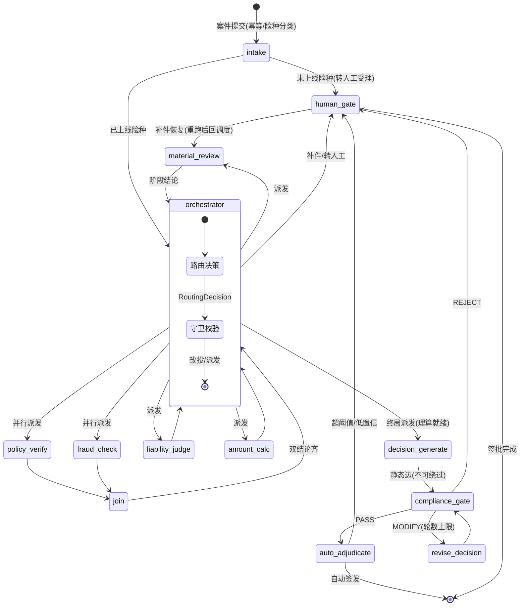

# 保险理赔智能核赔平台——总体架构方案 v2（Orchestrator 版）

> **版本说明**：v2.1（2026-09-04，D039 修订）——多险种前提确认，调度架构为
> **LLM Orchestrator-Worker 全动态 + 静态合规门 + 前置条件守卫 + skill 作业规程包**；
> 方向决策链见 `.agent/decisions.md` D037-D039。
> **先读人话版**：《claimflow-新架构设计-v2-人话版.md》；本文是工程实施版。

---

## 一、产品定位与范围

### 1.1 定位

案件驱动的理赔**核赔**平台：客户提交理赔申请（结构化字段 + 材料文件），系统自动完成核赔，
输出**理赔决定书 / 补件请求 / 转人工工单**。调度采用 **LLM Orchestrator** 多险种动态调度 +
前置守卫 + 静态合规门；覆盖**多险种**（medical/auto/property/accident），
worker 按险种分批上线。

### 1.2 多险种策略（D039）

- `case_type` 枚举：medical / auto / property / accident；受理期 LLM 结构化分类。
- worker 按"**险种 pack**"分批上线：**首批医疗险 pack**（复用现有工具/条款库/材料解析资产）；
  车险/财产险/意外险 pack 二期任务。
- **未上线险种**：受理期即转人工受理（明确提示），不进入 orchestrator 调度。
- 新增险种 = 新增 `skills/<stage>/<line>.md` 作业包 + 对应工具/mock + 金样本，**不改图结构**。

### 1.3 分级自动核赔

**自动签发**（全部满足）：材料完整 AND 责任认定 covered AND `risk_level == low`
AND `approved_amount <= AUTO_APPROVE_LIMIT`（配置，建议 5000 元）AND 全链路置信度 ≥ 阈值。

**转人工**（任一命中）：高风险 / 责任 partial·not_covered / 超金额阈值 / 抽取低置信 /
材料缺失补件超时 / orchestrator 或 worker 判定规则未覆盖 / 未上线险种受理 /
人工抽检采样（试点期建议 5%）。阈值全部进 `app/core/config.py`。

### 1.4 非目标（二期）

车险/财产/意外 worker pack、电子签章、医保结算对接、影像智能审核、客户小程序/短信通知、
监管报送导出。

---

## 二、关键设计决策总览

| # | 决策 | 理由 |
|---|---|---|
| 1 | LLM Orchestrator-Worker 全动态调度 + **前置条件守卫 + 静态合规门 + 失败兜底** | 多险种下路由是真决策，保留 LLM 调度；安全靠代码层对冲，不靠提示词自觉 |
| 2 | 全图骨架经正确性推演（第四节），派发目标与路由表全域一致 | 派发目标无映射会直接路由失败 |
| 3 | 挂起恢复用 `interrupt()` + `Command(resume=...)` | 官方挂起语义，T037 已验证 |
| 4 | 补件 → 材料审核重跑 → 回 orchestrator 重规划（第八节） | 审批流闭环完整 |
| 5 | **静态合规门**：decision_generate → compliance_gate 为图结构静态边，orchestrator 无法绕过 | F10 铁律；审批流的合规控制不能是概率性的 |
| 6 | 分域阶段模型（第五节）；金额 Decimal、日期 date | 类型/并行/序列化安全 |
| 7 | 并行派发 = `Command(goto=[Send, Send])`；字段唯一写者表（5.3） | 正确性 |
| 8 | AsyncPostgresSaver 常驻（D009） | 同步 saver 不适合常驻服务 |
| 9 | OTel + Prometheus + Grafana（D017） | 自托管、数据不出境 |
| 10 | 向量检索维持 Qdrant + pgvector | 不引第三套向量库 |
| 11 | OCR 用 vision LLM 两段式（D008/D024/D025） | PII 不出境，已验证 |
| 12 | uv + pydantic-settings + prompts 集中 + structlog | AGENTS.md 约定 |
| 13 | 架构多险种原生 + **医疗险 pack 首批**、每里程碑带门禁 | 范围与质量 |
| 14 | `skills/<stage>/<line>.md` 作业规程包，装载进 worker/orchestrator prompt | 准确率迭代改文本不改代码 |
| 15 | 硬门（金额 100%/红线 0/守卫拦截 100%）+ 软门（路由一致率 ≥95% 等） | 质量可证 |

---

## 三、技术栈

| 类别 | 选型 | 说明 |
|---|---|---|
| 语言/包管理 | Python 3.12 + uv + pyproject | 类型注解强制 |
| 编排 | LangGraph | orchestrator 循环：`Command(goto)` / `Send` 并行 / `interrupt` |
| LLM | OpenAI 兼容可配（deepseek-v4-flash 实证） | 调度与 worker 同主链路；vision 独立配置（D008） |
| skill 机制 | `skills/<stage>/<line>.md` + 装载器（纯文本，零新依赖） | D039；A/B 框架可对比 |
| Embedding/RAG | BGE-M3 + Qdrant + bge-reranker 可开关 + GraphRAG 可开关 | `services/rag/*` 整体保留 |
| Checkpoint | AsyncPostgresSaver（prod）/ InMemorySaver（dev） | thread_id = case_id |
| 业务库 | PostgreSQL + SQLAlchemy 2.0 async | cases / case_events（含路由决策审计）/ decision_documents |
| 缓存 | Redis（工具缓存白名单） | GuardedTool 保留 |
| Web | FastAPI async | conversations → cases |
| 可观测 | structlog + Prometheus + Grafana + OTel/Jaeger | 全套容器资产保留 |
| 部署 | Docker Compose（init 自举，D035 模式） | 保留 |

---

## 四、编排设计（本方案核心）

### 4.1 案件状态机



### 4.2 Orchestrator 设计

**决策模型**（T047 模式升级复用）：

```python
class RoutingDecision(BaseModel):
    """orchestrator 结构化输出：下一步派发目标（可多个=并行）+ 全量计划 + 理由。"""
    next: list[Literal[
        "material_review", "policy_verify", "fraud_check",
        "liability_judge", "amount_calc", "decision_generate", "human",
    ]]
    plan: list[PlanStep]     # [{stage, status, summary}]
    reason: str
```

**前置条件守卫（代码层，orchestrator 输出后强制执行）**：

| 路由目标 | 前置条件 | 违规时守卫动作 |
|---|---|---|
| policy_verify / fraud_check | material 完整 | 改投 material_review |
| 并行多目标 | 目标间无依赖（查依赖表） | 依赖冲突则砍成串行 |
| liability_judge | policy + risk 结论就绪 | 改投缺失的前置 |
| amount_calc | liability 就绪 | 同上 |
| decision_generate | calc 就绪，**且必须单独派发** | 同上 |
| 重派已完成 worker | 无 human_resolution 触发 | 丢弃，改派下一 pending |
| 终局（派 decision_generate） | 必做集 {material, policy, risk, liability, calc} 全 done | 改派首个缺失项 |

守卫修正在审计中显式记录（`guard_corrected: true`）——"AI 想违规但被代码拦下"本身是
可观测指标，也是评测断言对象。

**失败兜底**：orchestrator LLM 调用失败（超时/解析失败/熔断）→ 按险种的
**确定性默认计划**推进（医疗险 = 材料→保单∥风控→责任→理算→决定书标准管线），
案件不阻塞；连续失败计数进指标。

**调度 skill**：`skills/orchestrator/_shared.md`——调度规程（何时并行、何时转人工、
计划格式、险种差异表）。orchestrator 与 worker 同样吃 skill。

**决策审计**：每次 RoutingDecision（原始决策 + 守卫修正 + reason）落 `case_events`
（kind=routing），监管回放时"为什么走了这一步"逐步可查。

**防失控**：recursion_limit + ModelCallLimitMiddleware + 每案件调度调用数指标
（预算 ≤15 次，超限告警）。

### 4.3 图骨架

```python
# workflows/case_graph.py 骨架
WORKERS = ("material_review", "policy_verify", "fraud_check",
           "liability_judge", "amount_calc", "decision_generate")

builder = StateGraph(ClaimCaseState, input_schema=CaseInput, output_schema=CaseOutput)

builder.add_node("intake", intake_node)               # 幂等 + 险种分类（LLM 结构化）
builder.add_node("orchestrator", orchestrator_node)   # 路由决策 + 守卫 + 审计
for w in WORKERS:
    builder.add_node(w, worker_nodes[w])              # 各为子图/agent（第六节）

builder.add_node("compliance_gate", compliance_gate_node)
builder.add_node("revise_decision", revise_decision_node)
builder.add_node("auto_adjudicate", auto_adjudicate_node)
builder.add_node("human_gate", human_gate_node)       # interrupt

builder.add_edge(START, "intake")
builder.add_conditional_edges("intake", route_after_intake,
    {"orchestrator": "orchestrator", "human": "human_gate"})

# 工作层：worker 完成 → 回 orchestrator（decision_generate 例外）
for w in WORKERS[:-1]:
    builder.add_edge(w, "orchestrator")
# 并行 fan-in：policy_verify / fraud_check 由 orchestrator 同时 Send 派发，
# 汇聚由 LangGraph 超步语义天然完成（两分支都写入后 orchestrator 才重跑）
# 决定书链：静态边，orchestrator 调度空间之外（D039 安全设计 1）
builder.add_edge("decision_generate", "compliance_gate")
builder.add_conditional_edges("compliance_gate", compliance_route,
    {"pass": "auto_adjudicate", "modify": "revise_decision", "reject": "human_gate"})
builder.add_edge("revise_decision", "compliance_gate")
builder.add_conditional_edges("auto_adjudicate", adjudication_route,
    {"issue": END, "human": "human_gate"})
# human_gate 返回 Command(goto=...) 动态分流，不设静态出边
graph = builder.compile(checkpointer=checkpointer)
```

orchestrator 节点：

```python
async def orchestrator_node(state: ClaimCaseState) -> Command:
    decision = await route_llm(state)                      # RoutingDecision（装载调度 skill）
    guarded = enforce_guards(decision, state)              # 前置条件/去重/必做集（纯函数，单测全覆盖）
    await audit_routing(state["case_id"], decision, guarded)   # 决策审计 → case_events
    if "human" in guarded.next:
        return Command(update={"human_request": guarded.human_payload},
                       goto="human_gate")
    sends = [Send(w, worker_input(w, state)) for w in guarded.next]
    return Command(goto=sends, update={"task_plan": guarded.plan})
```

> 并行说明：`Command(goto=[Send(a), Send(b)])` 多目标在 LangGraph 同一超步内并行执行，
> 两分支的状态写入全部落地后 orchestrator 才重跑（fan-in）。并发性在 T079/T081 以
> 耗时与事件序断言验证。

human_gate（interrupt 模式，移植 T037）：

```python
async def human_gate_node(state: ClaimCaseState) -> Command[Literal["material_review", "__end__"]]:
    resolution: dict = interrupt({"kind": state.get("human_request", {}).get("kind"),
                                  "case_id": state["case_id"],
                                  "payload": state.get("human_request")})
    if resolution.get("kind") == "supplement":
        # 补件恢复：先重跑材料审核，完成后静态回 orchestrator 重新规划
        return Command(update={"human_resolution": resolution}, goto="material_review")
    # 坐席签批：结论过合规复审（T037 语义）后签发
    return Command(update={"final_decision": resolution["decision"],
                           "decision_document": resolution["document"]}, goto="__end__")
```

---

## 五、State 与阶段 Schema

### 5.1 主状态

```python
class ClaimCaseState(TypedDict, total=False):
    """核赔案件主图状态（total=False：各节点局部更新）。"""

    # ===== 案件标识 =====
    case_id: str
    user_id: str
    policy_id: str
    case_type: Literal["medical", "auto", "property", "accident"]  # intake 唯一写入

    # ===== 阶段结论（各字段唯一写者见 5.3；值为 stages.py 模型 dump）=====
    material: dict[str, Any] | None
    policy: dict[str, Any] | None
    risk: dict[str, Any] | None
    liability: dict[str, Any] | None
    calc: dict[str, Any] | None
    decision: dict[str, Any] | None
    compliance: dict[str, Any] | None

    # ===== 调度 =====
    task_plan: list[dict[str, Any]]          # orchestrator 维护的计划快照

    # ===== 交互与异常 =====
    messages: Annotated[list[AnyMessage], add_messages]
    human_request: dict[str, Any] | None
    human_resolution: dict[str, Any] | None
    errors: Annotated[list[dict[str, Any]], operator.add]

    # ===== 最终产出 =====
    final_decision: Literal["approved", "rejected", "partial", "referred"]
    decision_document: dict[str, Any] | None
```

### 5.2 阶段输出模型（示例：材料审核）

```python
class ExtractedDocument(BaseModel):
    doc_type: Literal["invoice", "diagnosis", "cost_list", "medical_record"]
    patient_name: str | None = None
    hospital: str | None = None
    diagnosis: str | None = None
    total_amount: Decimal | None = None      # 序列化存 str；严禁 float 参与金额计算
    treatment_date: date | None = None
    confidence: float = 0.0

class MaterialReviewOutput(BaseModel):
    documents: list[ExtractedDocument]
    completeness: Literal["complete", "partial"]
    missing: list[str] = Field(default_factory=list)
    confidence: float
```

其余阶段模型（PolicyVerifyOutput / FraudCheckOutput / LiabilityOutput / AmountCalcOutput /
DecisionDocOutput）在 `schemas/stages.py` 定义；worker 以这些模型作为子图 input/output
schema 与主图交互（字段名匹配自动映射），worker 只见必要字段。

### 5.3 字段所有权表（并行安全）

| 字段 | 唯一写者 | 主要读取者 |
|---|---|---|
| `case_type` | intake | orchestrator（skill 选择）/ 守卫 |
| `material` | material_review 子图 | 下游全部 / 补件重跑 |
| `policy` | policy_verify 子图 | liability / amount_calc |
| `risk` | fraud_check 子图 | orchestrator / auto_adjudicate |
| `liability` | liability_judge | amount_calc / decision |
| `calc` | amount_calc | decision / 合规金额断言 |
| `decision` | decision_generate / revise_decision | compliance / 签发 |
| `compliance` | compliance_gate | auto_adjudicate / 审计 |
| `task_plan` | orchestrator | 审计 / 工作台时间线 |
| `human_resolution` | human_gate（resume 后） | material_review / orchestrator |
| `final_decision` / `decision_document` | auto_adjudicate / human_gate | 出口 / API |
| `errors` | 各阶段（`operator.add` 追加） | orchestrator（重规划依据） |

并行安全：policy_verify 只写 `policy`、fraud_check 只写 `risk`——不同 channel 唯一写者，
无需合并 reducer；`errors` 显式 `operator.add`。

---

## 六、Worker 设计

| Worker | 职责 | LLM | 实现形态 | skill 包 | 现有来源 |
|---|---|---|---|---|---|
| intake | 幂等、险种分类、要素抽取 | 是 | LLM 节点 | skills/intake/_shared.md | 新写 |
| material_review | ingest→OCR→结构化抽取→完整性 | 是 | 子图 | skills/material_review/medical.md | materials.py + ocr_extract 移植 |
| policy_verify | 有效性/等待期/除外/限额 | 否 | 子图 | skills/policy_verify/medical.md | policy_query 移植 |
| fraud_check | 规则评分/黑名单/频率 | 否 | 子图 | skills/fraud_check/_shared.md | risk_scoring 扩展 |
| liability_judge | 责任认定/条款引用/置信度 | 是（ReAct+RAG） | create_agent 子图 | skills/liability_judge/medical.md | RAG 栈 + diagnosis_matcher |
| amount_calc | 理算/扣减/限额 | 否（确定性） | 函数节点 | skills/amount_calc/_shared.md | calculator 扩展 |
| decision_generate | 决定书撰写 | 是 | LLM 节点 | skills/decision_writer/medical.md | 新写 |

**skill 装载器**（`services/skills.py`，T081）：`load_skill(stage, line) -> str`；
system prompt = base 角色 + skill 文本；skill 缺失回退 base 并告警（医疗险首批齐备，
其他险种 pack 二期补）。

---

## 七、工具层

| 工具 | 来源 | 改造点 |
|---|---|---|
| `ocr_extract_document` | ocr_extract + materials.py | 输出对齐 ExtractedDocument |
| `validate_document_completeness` | 新 | 纯函数规则（按险种材料清单），零 LLM、必单测 |
| `query_policy_details` | policy_query | 扩展：等待期/除外/限额 |
| `query_customer_claims_history` | 新（mock） | 风控参考 |
| `query_blacklist` | 新（mock） | 风控参考 |
| `search_policy_terms` | claim_rule_rag + services/rag/* | 直迁（reranker/GraphRAG 可开关） |
| `diagnose_coverage_match` | diagnosis_matcher | 责任认定引用 |
| `calculate_claim_amount` | calculator | 扩展：部分责任比例/扣减明细，全 Decimal |
| `evaluate_fraud_rules` | risk_scoring | 扩展欺诈规则集 |

**守卫层原样保留**：`tools/{base,guards,factory}.py`（with_retry + GuardedTool 熔断/缓存），
新工具一律经 factory 装配。

---

## 八、HITL 与坐席工作台

**工单类型**：`SUPPLEMENT`（补件）/ `REVIEW`（核赔复核签批）/ `ESCAPE`（升级专家）。

**interrupt 触发点**：intake 未上线险种、材料缺件、compliance REJECT、高风险短路、
超阈值/低置信、orchestrator 裁量转人工。

**闭环**：坐席 resolve → `Command(resume=...)` 恢复 → 按 kind 分流
（补件 → material_review 重跑 → 回 orchestrator 重规划；签批 → 决定书签发）。
坐席/客户回写**必过合规复审**（T037 语义）。跨服务重启恢复由 checkpoint 保证。

**工作台改造**：工单类型筛选与徽章、补件材料上传、签批表单、案件时间线
（case_events 渲染，**含 orchestrator 路由决策与守卫修正**）。

---

## 九、持久化、幂等与审计

- **checkpoint**（AsyncPostgresSaver，thread_id=case_id）：图执行态——断点续跑、interrupt 挂起。
- **业务表**：`cases`（案件主档/状态机）、`case_events`（append-only 审计：阶段结论 +
  **kind=routing 决策记录**）、`decision_documents`（决定书版本化）、`human_tickets`、
  `customers` / `policies`（mock）。案件状态以业务表为准，图执行可重建。
- **幂等**：case_id 唯一约束 + intake 重复校验；工具缓存白名单。
- **金额**全链路 Decimal，序列化存 str/分。

---

## 十、合规门（铁律延续）

1. **静态门**：decision_generate → compliance_gate 为图结构静态边，不在 orchestrator
   调度空间——任何路由决策无法绕过（图结构断言进测试，T085）。
2. **三态 + 修订闭环**：PASS/MODIFY/REJECT + revise 轮数上限（D012 语义移植）。
3. **金额一致性断言（确定性）**：决定书正文金额 ≠ calc.approved_amount 直接拦——
   防 LLM 幻觉金额，不依赖 LLM。
4. **坐席/客户回写必审**（T037 语义）。
5. **PII 脱敏**：sensitive_filter 应用于决定书与对外出参。
6. **红线词表扩充**：决定书场景承诺性表述/监管用语（开放问题 1）。

---

## 十一、可观测性

- OTel 全套保留；每案件一个根 span，worker/调度为子 span；LangSmith 仅 env 调试选项。
- **新增业务指标**：`cases_total`、`auto_close_rate`、`referral_rate`、
  `supplement_rounds`、`stage_duration_seconds{stage}`、
  **`routing_calls_per_case`（预算 ≤15）**、**`guard_corrections_total`（守卫修正数）**、
  `orchestrator_fallback_total`（兜底触发数）、`decision_amount_distribution`、
  `tokens_per_case`。
- Grafana 面板改造：核赔漏斗、阶段耗时 P95、调度健康（修正率/兜底率）。

---

## 十二、评测体系与上线门

**复用**：evals 框架全套（test_suite/trajectory/metrics/eval_runner/evals API/评测台/
趋势/eval_runs/git_sha/wilson_ci），口径延续 D026/D033。

**金样本数据集**（150-200 案件，标注到分）：

| 类别 | 覆盖 |
|---|---|
| 正常通过 | 全责、金额阶梯（免赔内/上/逼近保额） |
| 拒赔 | 除外责任、等待期内出险、过期保单 |
| 部分责任 | 比例赔付、扣减明细 |
| 缺件补件 | 各材料类型缺失、补件闭环 |
| 风控 | 欺诈规则命中、黑名单、高频理赔 |
| 边界 | 重复申请、高金额阈值边界、低置信 OCR、材料矛盾 |
| 受理分类 | 多险种 case_type 分类、未上线险种转人工 |

**标注字段**：expected_amount（精确到分）/ expected_liability / expected_route
（自动 or 人工 or 补件）/ expected_worker_sequence（orchestrator 路由期望）/ expected_case_type。

**上线门**：

| 指标 | 类型 | 门禁 |
|---|---|---|
| 金额计算正确率 | 硬 | **100%** |
| 合规红线漏放行 | 硬 | **0** |
| 前置守卫拦截率（注入用例） | 硬 | **100%**（代码层断言） |
| orchestrator 路由与金样本期望一致率 | 软 | ≥ 95% |
| 材料关键字段抽取 F1 | 软 | ≥ 95% |
| 责任认定一致率 | 软 | ≥ 90% |
| 每案件调度调用数 | 预算 | ≤ 15 |
| 自动结案 vs 人工抽检一致率（试点） | 软 | ≥ 97% |

---

## 十三、目录结构

```
claimflow/
├── .agent/                     # AI 工具状态文件；历史条目只追加不改
├── app/api/v1/
│   ├── cases.py                # 案件提交/查询/材料上传
│   ├── interventions.py        # HITL 工单
│   └── health.py
├── app/core/                   # config（含核赔阈值组）/ logging / exceptions / eventloop
├── state.py                    # ClaimCaseState
├── schemas/
│   ├── case.py  stages.py  api.py  contract.py  lines.py  agent.py  tools.py
├── nodes/
│   ├── intake.py  orchestrator.py          # 调度（RoutingDecision + Send 并行派发）
│   ├── material_review.py  policy_verify.py  fraud_check.py
│   ├── liability_judge.py  amount_calc.py  decision_generate.py
│   ├── compliance_gate.py  human_gate.py
├── workflows/case_graph.py     # 主图定义与编译
├── tools/                      # base/guards/factory + claim/medical/compliance/fraud/document
├── services/                   # llm/rag/materials/observability/db/memory + skills.py + decision_doc.py
│   └── worker_agent.py         # create_agent Worker 子图装配
├── skills/                     # 作业规程包（D039）
│   ├── orchestrator/_shared.md
│   ├── material_review/medical.md
│   ├── policy_verify/medical.md
│   ├── fraud_check/_shared.md
│   ├── liability_judge/medical.md
│   └── decision_writer/medical.md
├── evals/                      # 金样本评测门（adjudication_suite + datasets/adjudication.json）
├── workbench/                  # 坐席工作台
├── chatui/                     # 案件提交门户
├── alembic/                    # cases/case_events/decision_documents 迁移
├── data/mock/                  # 多险种案件/保单/历史理赔/黑名单种子（首批医疗险）
├── docker-compose.yml  prometheus/  otelcol/  grafana/
├── pyproject.toml  .env.example  AGENTS.md
```

---

## 十四、实施路线图（T077-T093，已全部交付；详见 .agent/tasks.md Phase 8）

| 里程碑 | 任务 | 门禁 |
|---|---|---|
| M0 立项 | T077（spec/plan/tasks/AGENTS 定稿） | 本文档评审确认 |
| M1 骨架 | T078 域模型 → T079 主图骨架（兜底编排+守卫）→ T080 案件 API | 20 金样本（桩）金额/路由断言全绿；守卫单测全覆盖 |
| M2 LLM 化 | T081 skill+orchestrator → T082 材料审核 → T083 保单/风控 → T084 责任认定 → T085 决定书+合规门 | 守卫注入 100% 拦截；金额注入 100% 拦截；三态闭环 |
| M3 HITL | T086 interrupt 全链 → T087 工作台改造 | 补件/签批/跨重启恢复 e2e |
| M4 评测观测 | T088 金样本判分 → T089 上线门 → T090 埋点 | 硬门全绿 + 路由 ≥95% + 调用数 ≤15 |
| M5 收尾 | T091 演示门户 → T092 容器化 → T093 清理收尾 | 全量回归绿 |

每任务独立 commit，验收门禁全程生效。

---

## 十五、资产处置结果

处置已全部完成：基础设施（工具守卫 / RAG / 材料识别 / 监控追踪 / 评测框架）为现行组成，
现行模块清单以第十三节目录结构为准。

---

## 十六、开放问题

1. **决定书模板与红线词表**：需法务/合规口径确认（承诺性表述、监管用语清单）。
2. **AUTO_APPROVE_LIMIT 默认值**：建议 5000 元起，试点数据回看后调。
3. **补件交互渠道**：MVP 门户 + 工单；短信/小程序通知二期。
4. **第三方 OCR 备援**：vision LLM 两段式够用，商业 OCR 二期。
5. **人工抽检采样率**：试点期 5% 建议值待业务确认。
6. **车险/财产险 pack 是否进首批**：当前按二期规划；若要求进首批需追加任务（工作量约翻倍）。
7. **监管报送/审计导出格式**：二期。
